<!-- markdownlint-disable MD033 -->
<!-- markdownlint-disable MD041 -->

<link rel="stylesheet" href="../style.css">

<h1>IBM ThinkPad Supervisor Password Retrieval</h1>
<h2>T40-era (24-Series EEPROM)</h2>

<b>NthTry99</b><br>January 2026 (Revised April 2026)

<div class="image-row">
  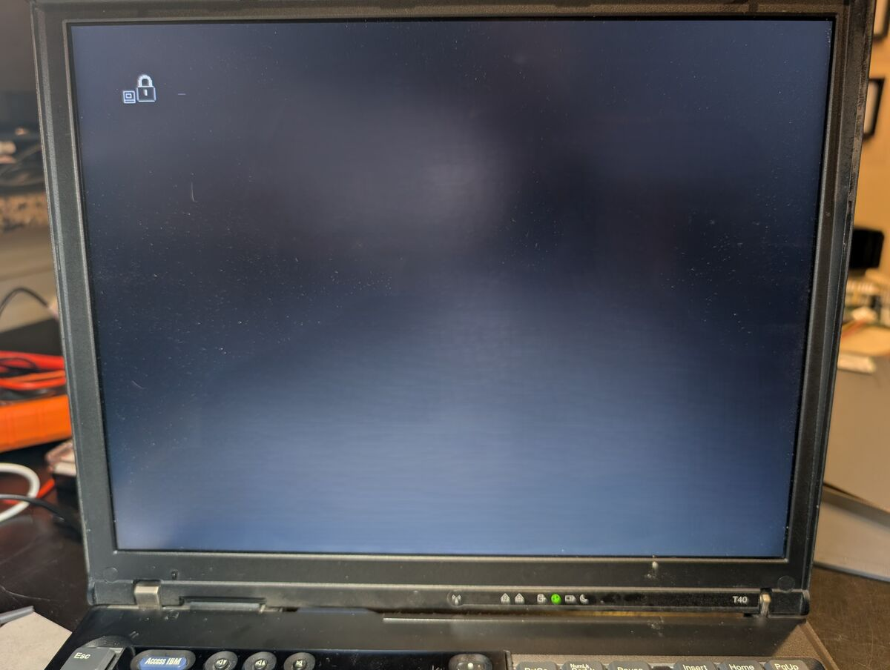
  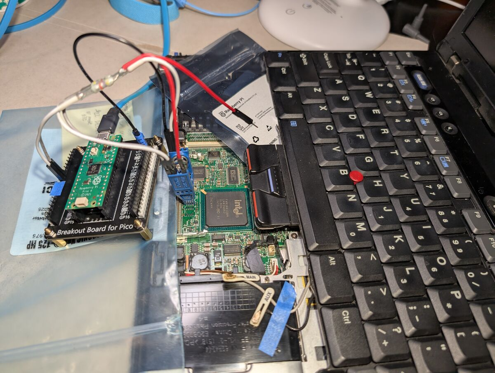
</div>

<h2>Table of Contents</h2>

- [1. Project Summary](#1-project-summary)
- [2. Research and Preparation](#2-research-and-preparation)
  - [2.1 Verify the Target EEPROM](#21-verify-the-target-eeprom)
  - [2.2 EEPROM Research](#22-eeprom-research)
- [3. Host-PC Configurations](#3-host-pc-configurations)
  - [3.1 Windows Subsystem for Linux (WSL2) Configurations](#31-windows-subsystem-for-linux-wsl2-configurations)
  - [3.2 Bare-Metal Linux Configurations](#32-bare-metal-linux-configurations)
  - [3.3 Install Additional Packages](#33-install-additional-packages)
- [4. Flash Firmware to Raspberry Pi Pico](#4-flash-firmware-to-raspberry-pi-pico)
  - [4.1 Download I2C-Pico-USB Firmware](#41-download-i2c-pico-usb-firmware)
  - [4.2 Copy Firmware to Pico](#42-copy-firmware-to-pico)
- [5. Configure Pico to Host PC Connection](#5-configure-pico-to-host-pc-connection)
  - [5.1 Installing Drivers for Windows](#51-installing-drivers-for-windows)
  - [5.2 Load I2C Modules](#52-load-i2c-modules)
  - [5.3 Verify Pico Connectivity](#53-verify-pico-connectivity)
- [6. Wire Pico to Test Clip](#6-wire-pico-to-test-clip)
- [7. Obtain EEPROM/SVP Data](#7-obtain-eepromsvp-data)
  - [7.1 Read/Dump Chip](#71-readdump-chip)
  - [7.2 Convert Dump (.txt) to Raw Binary (.bin)](#72-convert-dump-txt-to-raw-binary-bin)
  - [7.3 Decode the SVP](#73-decode-the-svp)
- [8. Test SVP and Reassemble Laptop](#8-test-svp-and-reassemble-laptop)

[The Access Protection Page (APP)](#unlockapp)

---

## <a id="1-project-summary"></a>1. Project Summary

This document describes a process to recover a lost/unknown Supervisor Password (SVP, aka BIOS password) from an IBM ThinkPad T40 (circa 2003). The SVP data is stored in an EEPROM chip on the motherboard, which will be obtained by dumping the data directly from the chip, using a Raspberry Pi Pico as an external I2C programmer. With this data, the password can be decoded via a script/software.

This process should also work for several other IBM ThinkPad models (i.e T41 and T42), and likely other laptops from that era.

I'm sure there are other methods, firmware, software, and tools available which are easier and do not require as many specific configurations. But, I am still learning and this is the process I was most comfortable with and knew the most about.

---

***DISCLAIMER: I am not responsible for any damage caused by, or misuse of, the information in this document. This document is purely for educational/informational purposes in the context of security research.***

***If you decide to try this and there is anything you do not understand in this document, be sure to ask or look it up!***

---

## <a id="2-research-and-preparation"></a>2. Research and Preparation

Before beginning, it is important to have a general understanding of electronics, components, memory, and familiarity with Windows/WSL or Linux.

Physical Tools Required:

- Host PC with Windows OR Linux
- Raspberry Pi Pico
- Breakout board/breadboard
- SOIC-8 test clip
- USB-A to Micro-USB (for the Pico)
- Jumper wires
- (2) 4.7kΩ resistors + some heat shrink
- Target IBM ThinkPad with unknown SVP

### <a id="21-verify-the-target-eeprom"></a>2.1 Verify the Target EEPROM

Verify (either physically or via research) that your IBM ThinkPad (target PC) uses a 24-series I2C serial EEPROM chip. Many IBM ThinkPad laptops in the late 1990s through early 2000s used these EEPROM chips. In this procedure I will be using my T40 (from 2003). While it is likely that this process would work on other laptops/PCs which use this series of EEPROM, I cannot guarantee anything.

Disassemble the laptop and locate the EEPROM chip. Look for an 8-pin SOIC-8 form-factor chip. On my T40 the EEPROM chip is under the Intel WM3B2100 internal WiFi network adapter card, which is directly under the TrackPad.

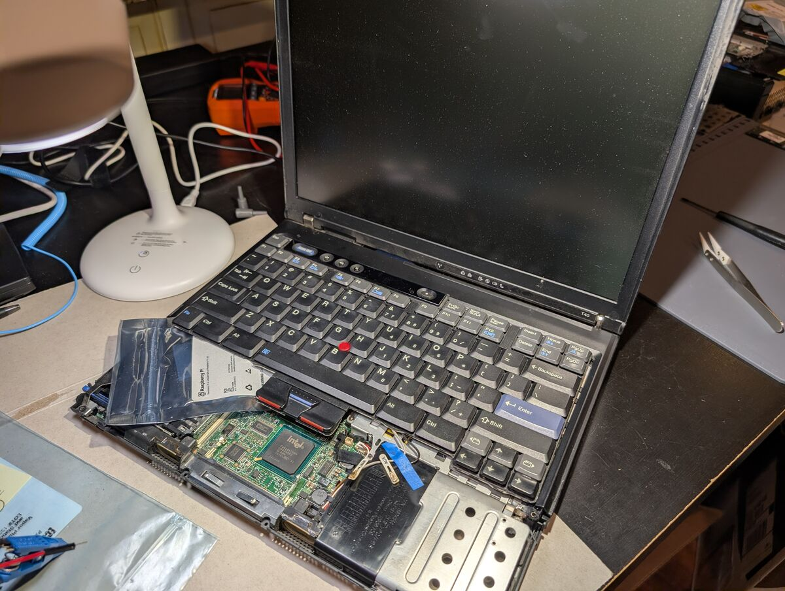

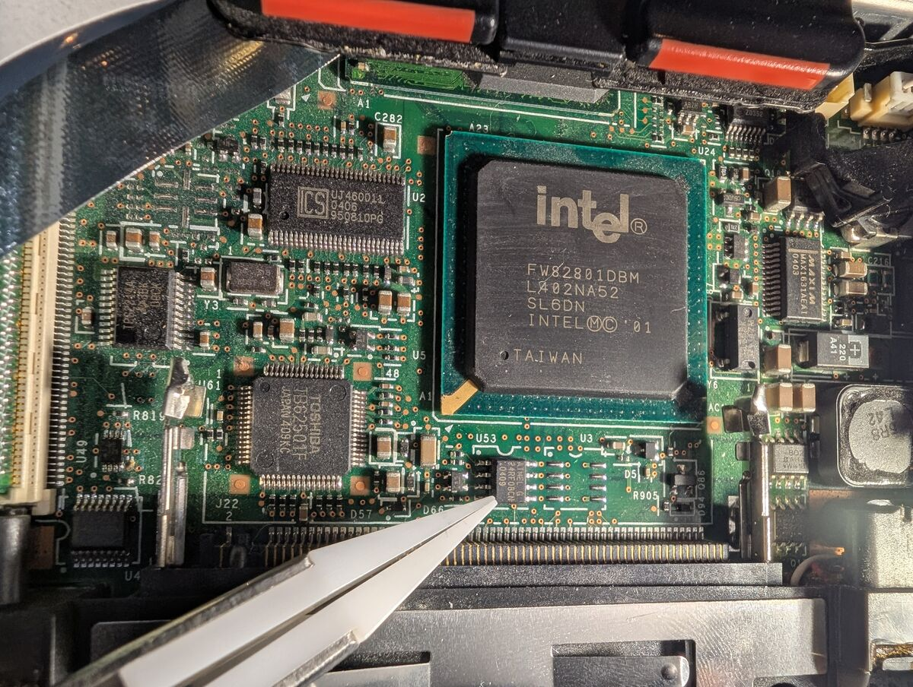

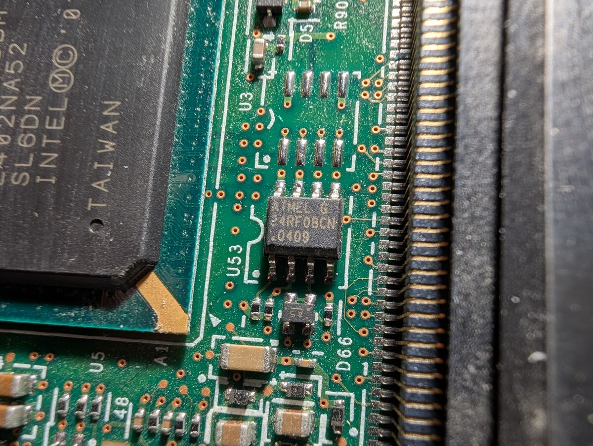

### <a id="22-eeprom-research"></a>2.2 EEPROM Research

Once you have found your EEPROM chip, it is important to look up its datasheet and learn about it. My EEPROM chip is an Atmel AT24RF08CN.

Here is a snippet from the datasheet:


The datasheet says its operating range is 2.4V-5.5V. To verify using a multimeter, I carefully tested the DC voltage from the EEPROM's VCC pin to a motherboard ground and it was 3.3V. The Raspberry Pi Pico also operates at 3.3V so I will use it in this guide.

If your EEPROM chip operates at 5V or 1.8V, see [Appendix 1 (AP1)](#ap1).

---

## <a id="3-host-pc-configurations"></a>3. Host-PC Configurations

The commands and tools used are Linux-based, so we will need either Windows with a specially configured Windows Subsystem for Linux (WSL2) environment OR (preferably) a Linux distro running on bare metal, which should work with minimal (if any) additional configuration.

I was very hesitant on keeping the following section (3.1 WSL2 Configurations) in this writeup as opposed to putting it in its own document. However, I decided to keep it here because it is still a requirement if you are following along and using Windows.

### <a id="31-windows-subsystem-for-linux-wsl2-configurations"></a>3.1 Windows Subsystem for Linux (WSL2) Configurations

**[WINDOWS ONLY] [if using Linux [skip to 3.2](#32-bare-metal-linux-configurations)]**

At the time of this writing, the stock Microsoft WSL2 kernel does not include I2C kernel modules, which function as device drivers for I2C adapter hardware. Therefore, we will have to compile a custom kernel to include these I2C modules.

<div style="margin-left: 2em;">
<b> 3.1.1 Install WSL2 (if not already installed) </b>

<div style="margin-left: 2em;">
3.1.1.1 Enable virtualization in UEFI:

<div style="margin-left: 2em;">
In your UEFI (BIOS) settings, be sure Intel (VMX) Virtualization Technology (VT-x) and Intel VT-d (Directed I/O) are Enabled.
</div>

<br>

3.1.1.2 Open PowerShell and install WSL:
<br>
<small><i>powershell:</i></small>

```powershell
wsl --install
```

<br>

This will install Ubuntu by default. The computer should restart. If it doesn't, do a manual restart. A Linux terminal should automatically open. If it doesn't, launch Ubuntu manually:

<small><i>powershell:</i></small>

```powershell
wsl
```

<br>

Follow the prompts and create a username/password for your Ubuntu distro. Then, immediately update Ubuntu (and restart if necessary):

<small><i>bash:</i></small>

```bash
sudo apt update && sudo apt upgrade
```

<br>

</div>

<b> 3.1.2 Configure Custom WSL2 Kernel Modules </b>

<div style="margin-left: 2em;">
3.1.2.1 Install build tools in WSL:

<small><i>bash:</i></small>

```bash
sudo apt update && sudo apt install build-essential flex bison libssl-dev libelf-dev bc dwarves python3 pahole cpio libncurses-dev
```

<br>

3.1.2.2 Identify the current kernel version:
<br>
<small><i>bash:</i></small>

```bash
uname -r
```

<br>

Output should be something like "6.6.87.2-microsoft-standard-WSL2" which means we want version 6.6.87.2

<br>

<a id="3123-go-to-home"></a>3.1.2.3 Go to Home directory and clone the specific branch of the kernel source:
<br>
<small><i>bash:</i></small>

```bash
cd && git clone https://github.com/microsoft/WSL2-Linux-Kernel.git --depth=1 -b linux-msft-wsl-6.6.87.2
```

</br>

See [Appendix 2 (AP2)](#ap2) for why we changed to home directory (cd).
<br>
See [Appendix 3 (AP3)](#ap3) for option meanings.

<br>

3.1.2.4 Verify the VERSION and PATCHLEVEL match the expected version:
<br>
<small><i>bash:</i></small>

```bash
cd WSL2-Linux-Kernel
head -n 5 Makefile
```

</br>
<small><i>output:</i></small>

```text
VERSION = 6
PATCHLEVEL = 6
SUBLEVEL = 87
EXTRAVERSION = .2
```

</br>
3.1.2.5 Copy the standard Microsoft configuration as a starting point:
<br>
<small><i>bash:</i></small>

```bash
cp Microsoft/config-wsl .config
```

<br>

3.1.2.6 Modify the configuration file to include the i2c-tiny-usb module/driver:
<br>
<small><i>bash:</i></small>

```bash
cp make menuconfig
```

<br>

A DOS-style GUI will appear.
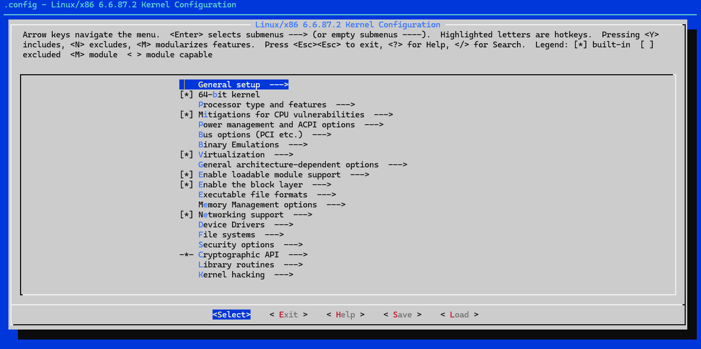
<br>

Navigate (using arrow keys) down to "Device Drivers --->" and press Enter.
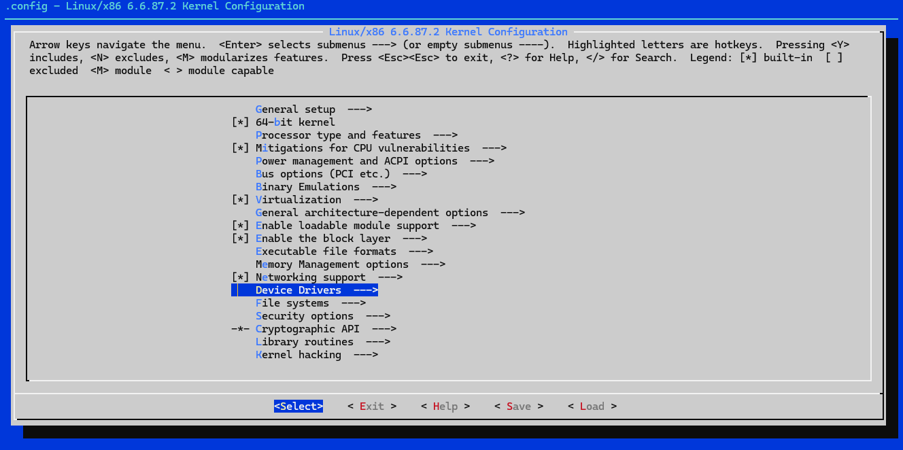
<br>

Navigate down to "I2C support --->" and press Enter.
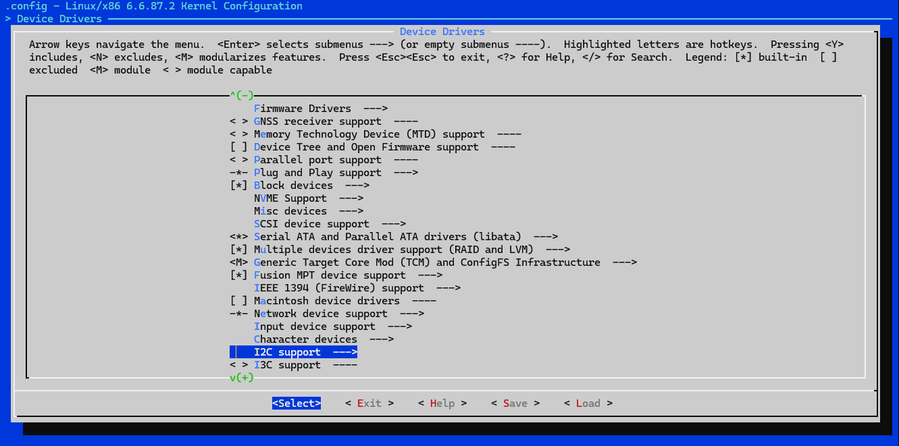
<br>

Make sure "I2C device interface" is enabled (with <*> by it). Press Y if not.
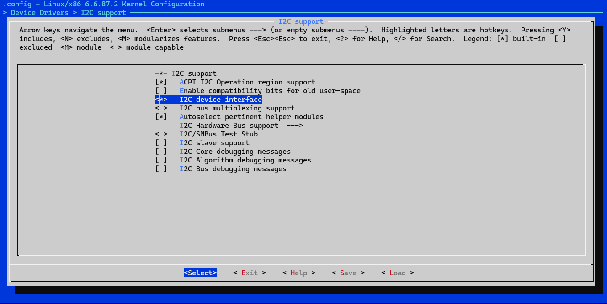
<br>

Navigate down to "I2C Hardware Bus support --->" and press Enter.
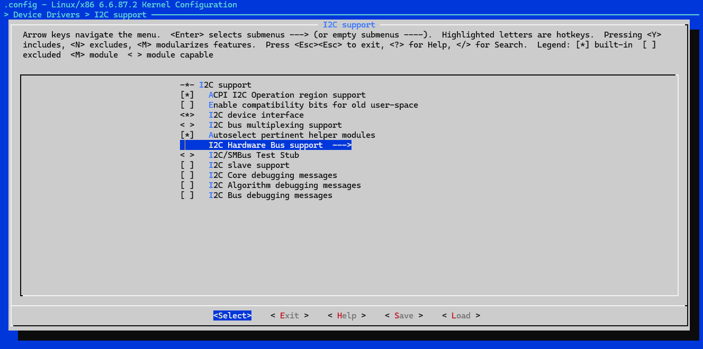
<br>

Navigate down to "Tiny-USB adapter" and press Y. You might see a screen saying "This feature depends on another which has been configured as a module. As a result, this feature will be built as a module." This is ok, press Enter.

<br>

You should now see \<M> by Tiny-USB adapter:
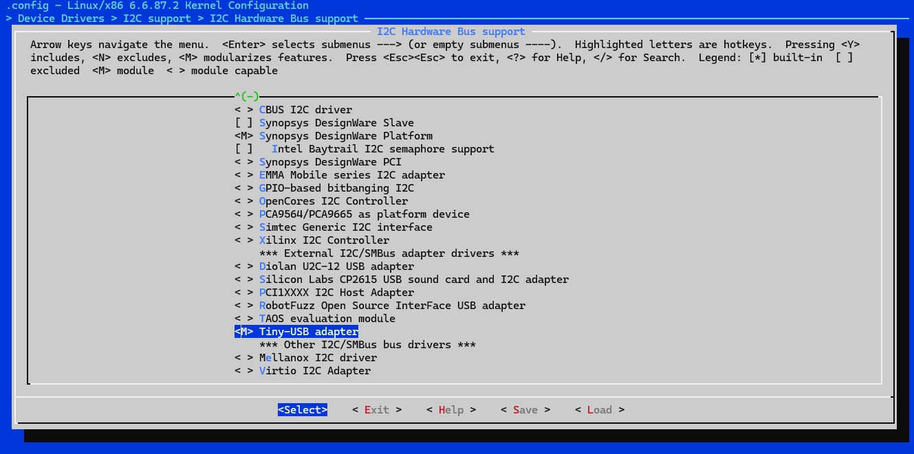
<br>

Navigate to the right and select Save and then Exit.
<br>
Overwrite the old .config file.

</div>
<br>
<a id="313-compile-the-custom-kernel"></a><b>3.1.3 Compile the Custom Kernel and Modules</b>

<small><i>bash:</i></small>
<br>

```bash
make -j$(nproc)
```

See [Appendix 4 (AP4)](#ap4) for option meanings.
<br>
**To keep one core free for system use, you can use
<br>
<small><i>bash:</i></small>
<br>

```bash
make -j$(($(nproc) - 1))
```

When it finishes, it should creae a file:
<br>
<i>./WSL2-Linux-Kernel/arch/x86/boot/bzImage</i>
<br>
If this file is 0 bytes in size, then it did not compile correctly.

<br>
<b> 3.1.4 Load the Modules into the Linux Filesystem </b>

<small><i>bash:</i></small>
<br>

```bash
sudo make modules_install
```

<br>
<b> 3.1.5 Copy the Custom Kernel into Windows </b>

<small><i>bash:</i></small>
<br>

```bash
cp ./WSL2-Linux-Kernel/arch/x86/boot/bzImage /mnt/c/Users/YourUsername/bzImage
```

<br>
<b> 3.1.6 Configure WSL to use your Custom Kernel </b>
<br>
Create or Open C:\Users\YourUsername\.wslconfig:

<small><i>bash:</i></small>
<br>

```bash
nano /mnt/c/Users/YourUsername/.wslconfig
```

Add the following 2 lines, with the second line including the path to your bzImage. If "[wsl2]" is already there, do not add it again, just add the second line below it. Make sure to use double backslashes for the path:

```text
[wsl2]
kernel=C:\\path\\to\\your\\bzImage
```

<br>
<b> 3.1.7 Exit and Restart WSL </b>

<small><i>bash:</i></small>
<br>

```bash
exit
```

<small><i>powershell:</i></small>

```powershell
wsl --shutdown
wsl
```

<br>
<b> 3.1.8 Install a Passthrough USB Adapter </b>

Download/install usbipd-win_5.3.0_x64.msi [https://github.com/dorssel/usbipd-win/releases/tag/v5.3.0](https://github.com/dorssel/usbipd-win/releases/tag/v5.3.0)
<br>
USBIPD-WIN is an open-source virtual passthrough adapter used to share locally connected USB devices (our I2c Pico) from a Windows host to other machines or environments (WSL2).


</div>

### <a id="32-bare-metal-linux-configurations"></a>3.2 Bare-Metal Linux Configurations

**[LINUX ONLY]**

***NO SPECIAL CONFIGURATION REQUIRED***
<br>
Most major Linux distros already include I2C kernel modules, although they may not be loaded by default. Verifying/loading them will be the same process as for WSL, later in this guide. You will also not need a virtual passthrough adapter (usbipd-win) since the I2C programmer will be directly communicating with the Linux kernel.

### <a id="33-install-additional-packages"></a>3.3 Install Additional Packages

**[BOTH WSL and Linux]**

Download i2ctools and usbutils:
<br>
<small><i>bash:</i></small>
<br>

```bash
sudo apt install i2c-tools usbutils
```

***The remainder of this guide is the same for both WSL2 and Linux unless otherwise noted***

---

## <a id="4-flash-firmware-to-raspberry-pi-pico"></a>4. Flash Firmware to Raspberry Pi Pico

Next, we will need to flash special firmware to the Raspberry Pi Pico which will transform it into a USB-to-I2C bridge.

### <a id="41-download-i2c-pico-usb-firmware"></a>4.1 Download I2C-Pico-USB Firmware

I will be using I2C-Pico-USB firmware from [https://github.com/dquadros/I2C-Pico-USB](https://github.com/dquadros/I2C-Pico-USB)

On this GitHub repo, within the "firmware" directory, you can find a "build_pico" directory, which contains i2cpicousb.uf2 (use "build_pico2" if you are using a Pico2). This is the pre-compiled firmware we will be flashing to our Pico. Save this file.

Alternatively, if you would like, you can clone this repository and compile it yourself. There are instructions on the GitHub page above.

### <a id="42-copy-firmware-to-pico"></a>4.2 Copy Firmware to Pico

To flash firmware to a Raspberry Pi Pico, hold the "BOOTSEL" button on the Pico while plugging it into the host PC, then release the button. This will put the Pico into Bootloader Mode.

The Pico should now show up in Windows Explorer/File Manager as a USB Mass Storage Device, like a USB flash drive. Copy i2cpicousb.uf2 directly to the root of the Pico.

---

## <a id="5-configure-pico-to-host-pc-connection"></a>5. Configure Pico to Host PC Connection

Now that the host-PC environment is prepared and the Pico firmware has been flashed, it is time to configure their connection:

### <a id="51-installing-drivers-for-windows"></a>5.1 Installing Drivers for Windows

**[WINDOWS ONLY] [if using Linux [skip to 5.2](#52-load-i2c-modules)]**

Before configuring drivers, the I2C-Pico-USB will show up in Device Manager as an "Other device" and not have any drivers:
<br>
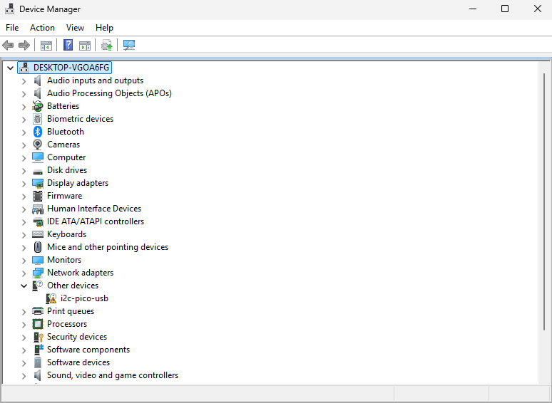

<br>
<div style="margin-left: 2em;">
<b> 5.1.1 Install libusb-win32 Driver </b>

- Download the latest release of Zadig from the following link: [https://zadig.akeo.ie/](https://zadig.akeo.ie/)
- Next, ensure the Pico is plugged in to the host PC and run the Zadig executable (zadig-2.9.exe).
- The Pico should appear in the top drop-down box as i2c-pico-usb:<br>
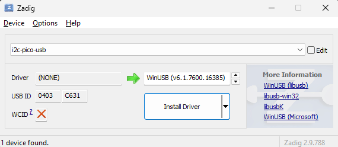
- Select "libusb-win32" from the box below with the tiny arrows and click Install Driver. It may take a minute.<br>
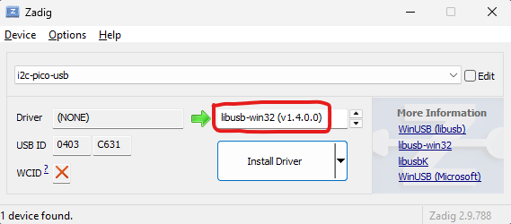
- Now, in Device Manager, it should look like this:<br>
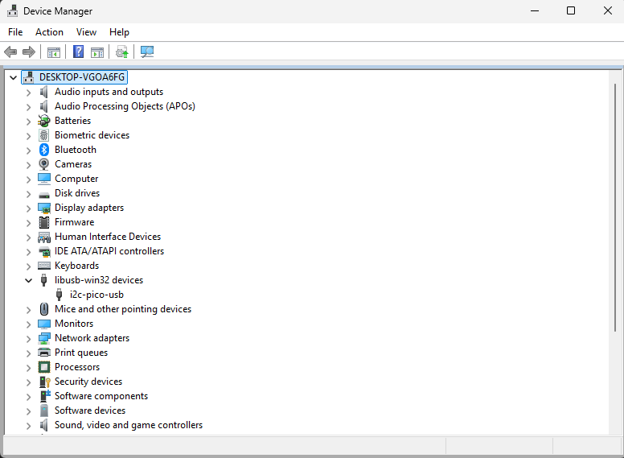

<br>
<b> 5.1.2 Have Both PowerShell and WSL Open </b>

Make sure you have WSL open in one window/tab and a regular PowerShell (admin) open in another. We will be using both.

<br>
<b> 5.1.3 Check Connectivity/Passthrough Status of i2c-pico-usb </b>
<br>
List devices which can be shared with WSL:
<br>
<small><i>powershell:</i></small>

```powershell
usbipd list
```

<br>
<small><i>Output (abridged):</i></small>

```text
BUSID  VID:PID    DEVICE                          STATE
1-4    0403:c631  i2c-pico-usb                    Not shared
```

<br>
Full Output:

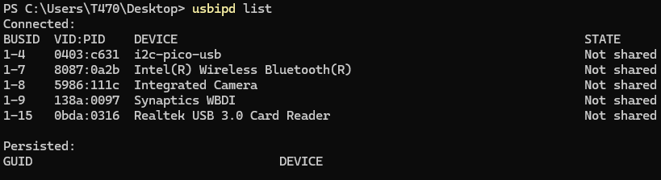

<br>
<b> 5.1.4 Share the USB Device (Pico) with usbipd </b>
<br>
This gives usbipd access to our Pico. Per the output above, my BUS ID is 1-4:
<br>
<small><i>powershell:</i></small>

```powershell
usbipd bind --busid 1-4
```

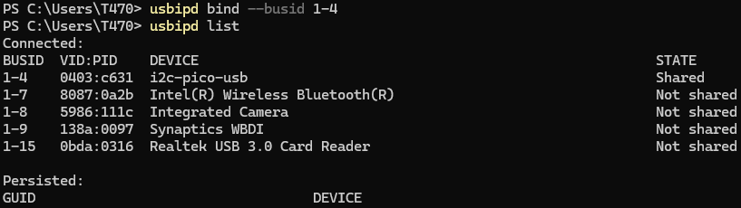

<br>
<b> 5.1.5 Redirect Pico to WSL </b>
<br>
This will redirect the connection of our physical USB device (Pico) from Windows into all running WSL2 distributions:
<br>
<small><i>powershell:</i></small>

```powershell
usbipd attach --wsl --busid=1-4
```

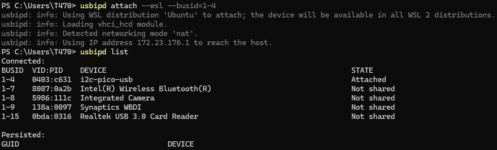

***NOTE: you will have to run this command every time you connect the Pico to the host PC in order for WSL to see it. Run the above command from a separate PowerShell window while WSL is running.***

Also, i2c-pico-usb will no longer show up in Device Manager after attaching it to WSL via the usbipd attach command, but it will be visible to Linux.

</div>

### <a id="52-load-i2c-modules"></a>5.2 Load I2C Modules

**[BOTH WSL and Linux]**

Load the I2C kernel modules:
<br>
<small><i>bash:</i></small>

```bash
sudo modprobe -a i2c-tiny-usb i2c-dev
```

<br>
Verify I2C modules are loaded:
<br>
<small><i>bash:</i></small>

```bash
lsmod | grep i2c
```

<br>
You should see 3 modules in the output:
<br>
<small><i>Output (abridged):</i></small>

```text
i2c_dev                24576  0
i2c_tiny_usb           16384  0
usbcore               356352  1 i2c_tiny_usb
```

<br>
Full Output:

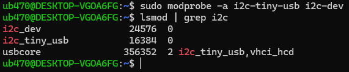

### <a id="53-verify-pico-connectivity"></a>5.3 Verify Pico Connectivity

<div style="margin-left: 2em;">
<b>5.3.1 Verify USB Connectivity</b>
<br>
<small><i>bash:</i></small>

```bash
sudo lsusb
```

Output should be something like:
<br>
<small><i>Output (abridged):</i></small>

```text
Bus 001 Device 002: ID 0403:c631 Future Technology Devices International, Ltd i2c-tiny-usb interface
```

<br>
<br>
<b>5.3.2 Verify I2C Adapter (Pico firmware) Connectivity</b>
<br>
<small><i>bash:</i></small>

```bash
sudo i2cdetect -l
```

Output should be something like:
<br>
<small><i>Output (abridged):</i></small>

```text
i2c-0   i2c             i2c-tiny-usb at bus 001 device 002      I2C adapter
```

<br>
In the output above, i2c-0 indicates that our I2C adapter is on bus 0. This info is needed later for our read/dump commands. Full output:

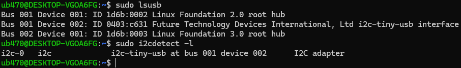

</div>

---

## <a id="6-wire-pico-to-test-clip"></a>6. Wire Pico to Test Clip

Next, we will prepare jumper wires (including the necessary pull-up resistors) from the EEPROM/SOIC-8 test clip to the Pico.

**---It is VERY IMPORTANT to understand that we will be using the TARGET LAPTOP itself to provide the 3.3V to the EEPROM (in circuit), NOT THE PICO. For more information on why, see [Powering the EEPROM Chip](#poweringeeprom)---**

<br>
<b>EEPROM/Test Clip:</b>
<br>
Here is the pinout for my EEPROM chip (and subsequently where the test clip will attach):

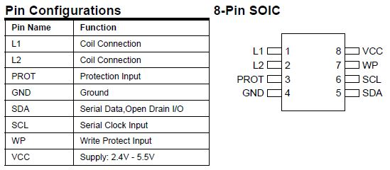
<br>
<i>--For this project, we will not use L1 (pin 1), L2 (pin 2), or WP (pin 7)--</i>

See [Appendix 5 (AP5)](#ap5) for a deeper explanation of these pin functions.

Here is the wiring to the test clip/EEPROM:
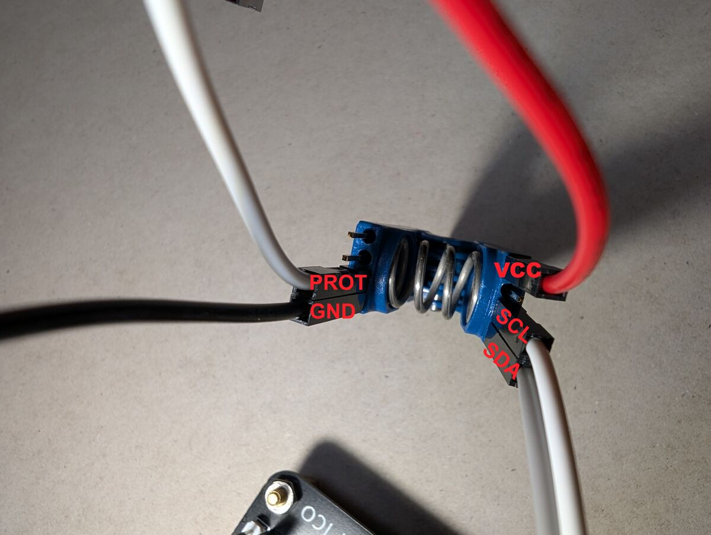

<br>

<b>Connections to Make:</b>
<br>
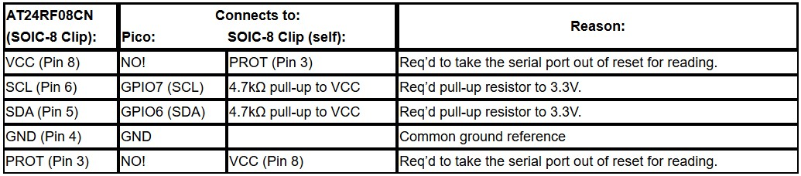

<b>Schematic:</b>
<br>
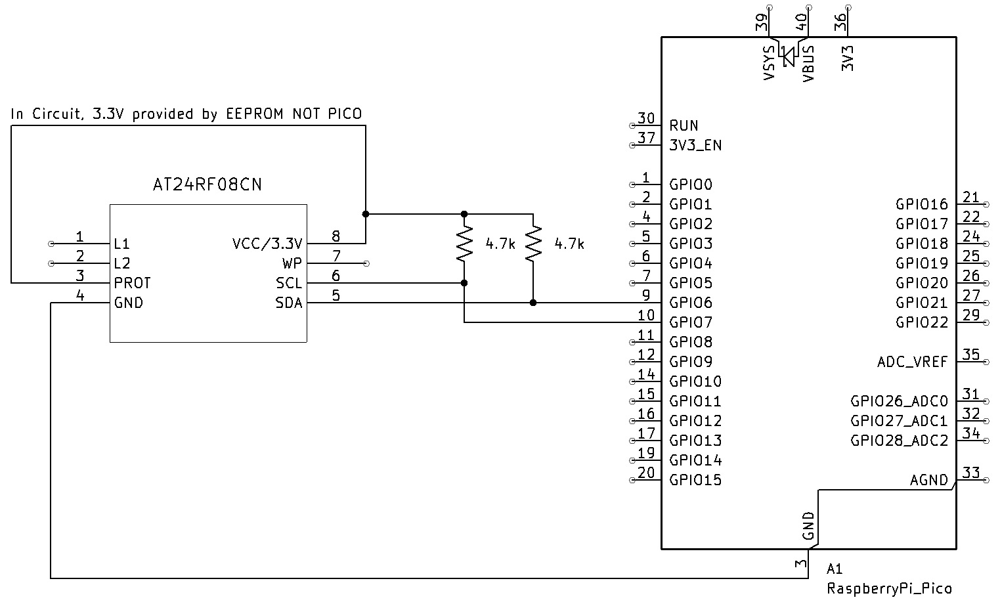

<br>

<b>Pico Connections:</b>
<br>
Here is the wiring to the Pico:
<br>
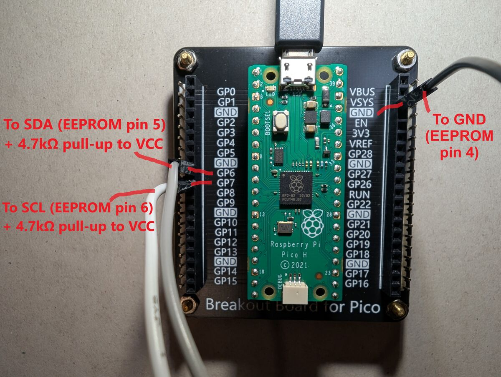

Here is my wiring setup:
<br>
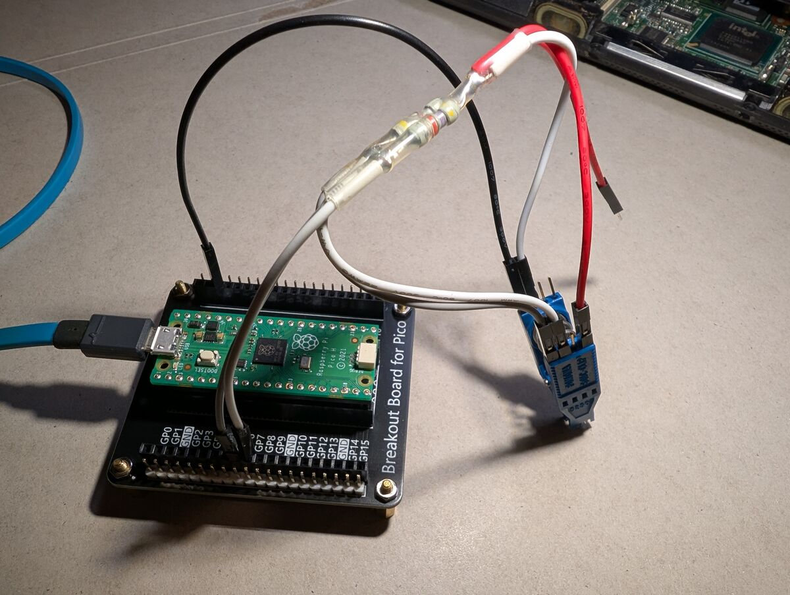

Once everything is connected, double and triple check that everything is connected properly.

<a id="6-test-clip-review"></a>On the test clip, you should have:

- a wire from the EEPROM VCC (Pin 8) to the EEPROM PROT (Pin 3)
- a wire with a 4.7k Ohm resistor across the EEPROM SDA and EEPROM VCC
- a wire with a 4.7k Ohm resistor across the EEPROM SCL and EEPROM VCC
- a wire from the EEPROM GND to Pico GND
- a wire from the EEPROM SDA (Pin 5) to the Pico SDA (GPIO6)
- a wire from the EEPROM SCL (Pin 6) to the Pico SCL (GPIO7)
- NO WIRE from the EEPROM VCC/3.3V to the Pico!

See [Appendix 6 (AP6)](#ap6) for wiring tips.

<i>Official instructions/source for the I2C-Pico-USB firmware are on [https://github.com/dquadros/I2C-Pico-USB](https://github.com/dquadros/I2C-Pico-USB)</i>

---

## <a id="7-obtain-eepromsvp-data"></a>7. Obtain EEPROM/SVP Data

With the host PC and Raspberry Pi Pico configured, and all wiring prepared, it is time to actually read the EEPROM data.

Here is another part where I'm sure there's room for improvement: I will be using i2cdump, which reads the data and outputs it into a human-readable formatted hex dump as well as ASCII translations. I am sure there is a command to dump the memory block directly as a raw binary file (.bin). However, I tried several different tools/commands, including i2ctransfer, and was unable to get consistent, safe results.

Due to the nature of I2C EEPROMs, reading from an address actually requires a "dummy write" to set the chip's internal address pointer prior to retrieving the data. While it isn't supposed to actually write data during this dummy write, when I tried i2ctransfer it DID somehow either write or otherwise corrupt data at the first offset of the memory address I was attempting to dump. Luckily, I was able to recover the data to its original state, but this was enough to steer me back to just using/converting i2cdump.

In the future, I am going to buy a loose AT24RF08CN EEPROM chip and troubleshoot/test other read commands without risking bricking a laptop. I might even just write my own program to read/write/unlock it.

### <a id="71-readdump-chip"></a>7.1 Read/Dump Chip

<div style="margin-left: 2em;">
<b> 7.1.1 Hook Everything Up </b>

Attach test clip to EEPROM chip, power on the target laptop first (it likely won't boot or display anything on the screen), then connect Pico to host PC.

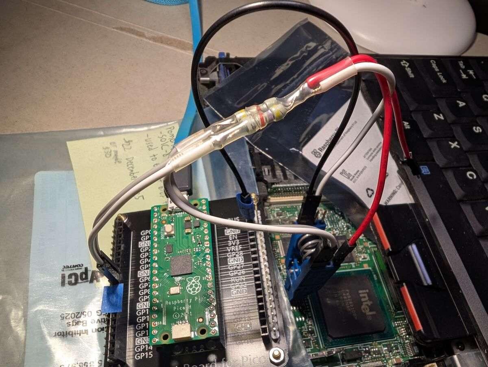

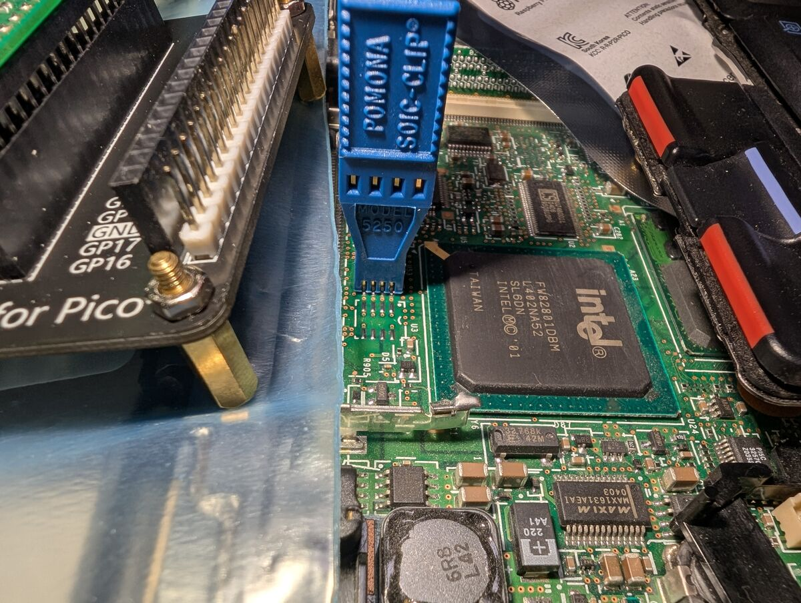

<br>
<a id="712-check-connectivity"></a><b> 7.1.2 Check Connectivity To Chip </b>
<br>
Scan devices on I2C bus 0:

<small><i>bash:</i></small>
<br>

```bash
sudo i2cdetect -y -r 0
```

See [Appendix 7 (AP7)](#ap7) for options meanings.

You should get a table of responding addresses:

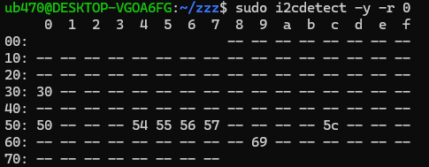

<a id="712-7bit"></a>The above addresses are the 7-bit addresses (the 8th bit indicates read/write). The 24RF08CN datasheet uses 8-bit addresses but i2ctools (i2cdetect, i2cdump, etc.) use 7-bit addresses.

For details on how data is stored on this EEPROM chip see [Appendix 8 (AP8)](#ap8).

For an explanation of 7-bit vs 8-bit addresses, see [Appendix 9 (AP9)](#ap9).

The main data blocks are at addresses 0x54-0x57, the SVP is in Block 6 (first half of 0x57).

<br>
<b>7.1.3 Dump Memory Address 0x57</b>
<br>
Dump 0x57, aka Block 6 and 7, which is where the SVP data is stored:
<br>
<small><i>bash:</i></small>
<br>

```bash
sudo i2cdump -y 0 0x57 > 0x57DUMP.txt
```

<br>
Open this file, it should look like this:

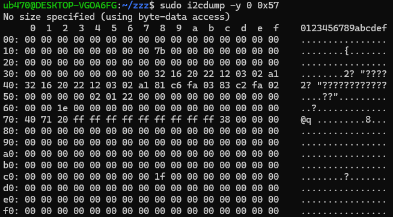

**NOTE: if your 0x57 dump looks like this (with all the XXs):
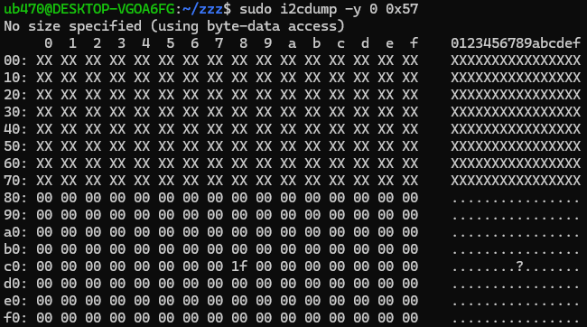
<br>
then go to [The Access Protection Page (APP)](#unlockapp) section at the bottom.

<br>
<b id="714">7.1.4 Power Off Target, Disconnect Programmer</b>
<br>
Now that we have a dump of memory address 0x57, power off the target PC, disconnect the Pico (USB) from host PC, and disconnect the test clip from the EEPROM chip.

</div>

### <a id="72-convert-dump-txt-to-raw-binary-bin"></a>7.2 Convert Dump (.txt) to Raw Binary (.bin)

Run the following command to convert the formatted hex dump (.txt) to binary (.bin):
<br>
<small><i>bash:</i></small>
<br>

```bash
cat 0x57DUMP.txt | awk '/^[0-9a-f]0:/{for(i=2;i<=NF;i++) if($i ~ /^[0-9a-fA-F]{2,4}$/) printf "%s", $i} END{print ""}' | xxd -r -p > 0x57DUMP.bin
```

For an explanation of this command, see [Appendix 10 (AP10)](#ap10).

### <a id="73-decode-the-svp"></a>7.3 Decode the SVP

Now that we have a dump of the memory block containing the Supervisor Password data, it is time to decode and uncover the password. Within that 0x57 block dump, the SVP should be at offset 0x38 and repeat at 0x40.

Note that the hex data at these offsets are scancodes representing the SVP, not ASCII (human-readable) data. To uncover the password, you need to decode these scancode values into ASCII characters. There are 4 primary options:

OPTION 1:

- ibmpass2.2Lite by ALLservice (freeware, semi-non-shady software from 2004, last updated in 2013) ([https://www.allservice.ro/store/utils/](https://www.allservice.ro/store/utils/))
- Will require WINE if used in Linux
- Screenshot:
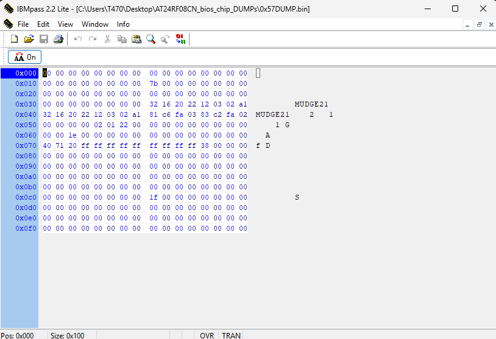

<br>
OPTION 2:

- ibmsupervisor script (requires Python, from [https://gitlab.com/eloydegen/ibmsupervisor](https://gitlab.com/eloydegen/ibmsupervisor)). Last updated in 2022.
- This did not work for me without tweaking the code.

<br>
OPTION 3:

- manually look at the data (either the 0x57DUMP.txt or open the .bin in a hex editor, such as HxD) and compare it to the scancode translations and decode the password yourself
- I have also included these translations in the file scancodes.txt (derived from [https://aeb.win.tue.nl/linux/kbd/scancodes-1.html](https://aeb.win.tue.nl/linux/kbd/scancodes-1.html))

<br>
***OPTION 4*** RECOMMENDED:

- ibmSVP_scanDecoder
- This is a script/program I made specifically for analyzing this block data, locating the SVP data, and translating it into plain text.
- The CLI version is really just a modified version of ibmsupervisor so some credit goes to whoever made that. My version requires no tweaking, however.
- The GUI version, ibmSVP_scanDecoderV3.1.exe for Windows was made from scratch. The Linux version, ibmSVP_scanDecoder-3.1-x86_64.AppImage may or may not be completed yet.

<br>
<b>USING ibmSVP_scanDecoder:</b>
<br>
The GUI Version:
<div style="margin-left: 2em;">

WINDOWS:
<br>
Simply run ibmSVP_scanDecoderV3.1.exe:
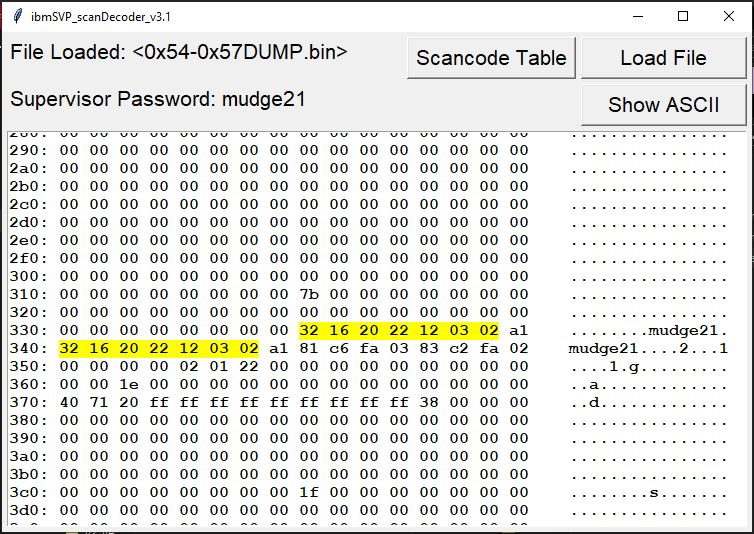
<br>
Very straightforward. My application can decode the SVP from the specific SVP block or a full 1024-byte EEPROM dump, and can process dumps in .txt OR .bin formats. So you can just load the output of i2cdump right into it if you want.

<br>
LINUX:
<br>
ibmSVP_scanDecoder-3.1-x86_64.AppImage
<br>
Must give execute permission, for example:
<br>
<small><i>bash:</i></small>

```bash
chmod +x ibmSVP_scanDecoder-3.1-x86_64.AppImage
```

</div>
<br>
The CLI Version:
<br>
ibmSVP_scanDecoder_CLI.py

<br>
**The EEPROM data must be a .bin**
<div style="margin-left: 2em;">
WINDOWS:
<br>
**Requires Python**
<br>
<small><i>powershell:</i></small>

```powershell
python .\ibmSVP_scanDecoder_CLI.py --file yourDUMP.bin
```

<br>
LINUX:
<br>
**Requires python3**
<br>
Must give execute permission, for example:
<br>
<small><i>bash:</i></small>

```bash
python3 ibmSVP_scanDecoder_CLI.py --file yourDUMP.bin
```

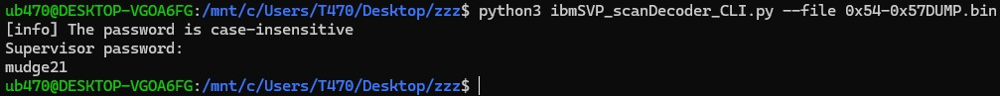

</div>

---

## <a id="8-test-svp-and-reassemble-laptop"></a>8. Test SVP and Reassemble Laptop

Power on the target PC and use the Supervisor Password you uncovered:

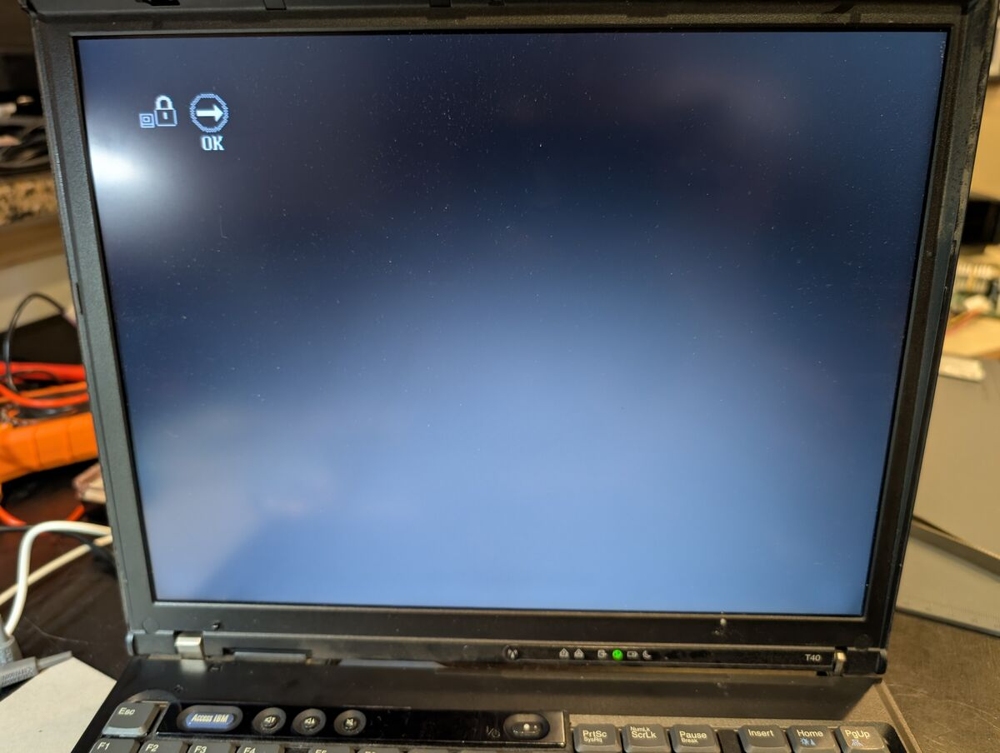

You should now have full access to the BIOS settings where can keep, change, or remove the SVP:

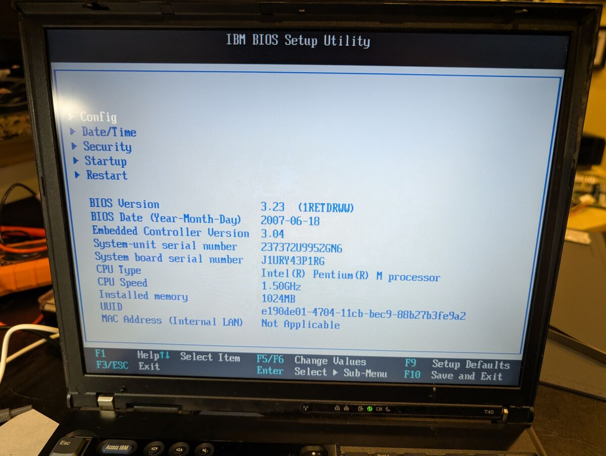

 Reassemble the laptop and you are done.

 ---

<h2>---Afternote---</h2>

This is the safest and easiest way to recover an unknown Supervisor Password from a BIOS-locked IBM ThinkPad of this era which utilizes this series of EEPROM. If you were to try directly changing or removing (zeroing out) the SVP within the EEPROM (in 0x57), you would likely encounter a POST error (Error 0177) because there are data validation measures (a checksum) in place to prevent this very thing. If you are interested in more details regarding this, I have a separate project called IBM_ThinkPad_CRC_Calculator where I dive into this, as well as other BIOS/POST Errors related to CRCs.

---
---

<b id="unlockapp">The Access Protection Page (APP)</b>
<br>
The following info is based on this forum post: [https://forum.reveltronics.com/viewtopic.php?t=292](https://forum.reveltronics.com/viewtopic.php?t=292)
<br>
Many 24-series EEPROM chips (including my AT24RF08CN) have additional security features which can prevent access to main data blocks. It does this by setting certain bits in memory called Protection Bits (PB) to either 0 or 1. These bits are stored at certain offsets in the APP at memory address 0x5C. Specifically, this feature can be used to "lock" access to block 6 (memory address 0x57) which is where the SVP data is. More info is available on the datasheet.

I have not been able to determine exactly what triggers the setting of these Protection Bits. Interestingly, if you do have access to the BIOS menu, changing the SVP or any BIOS setting seems to oftentimes toggle this lock. However, if you do not have access to the BIOS menu and this lock is engaged, there is no option other than manual intervention via an external programmer to unlock it and therefore access the SVP data.

For testing purposes, one way I was able to get this lock enabled was to engage the "Security Chip" setting in the BIOS settings:

- On the main BIOS menu, there is a Security page:
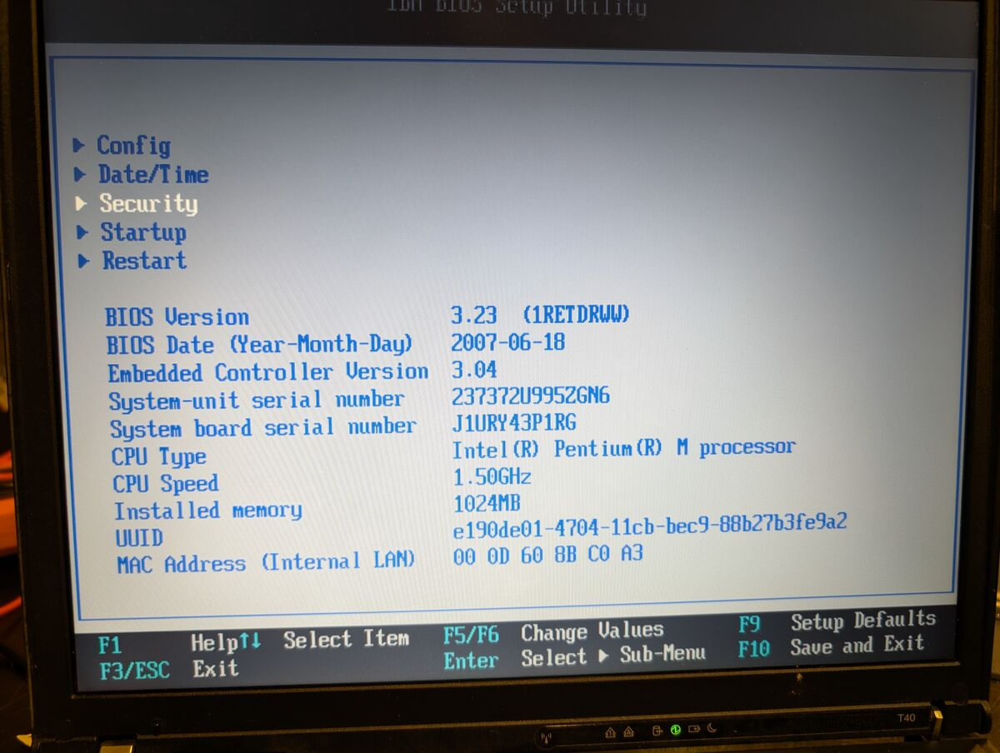

- On the Security page, there is an IBM Security Chip page:
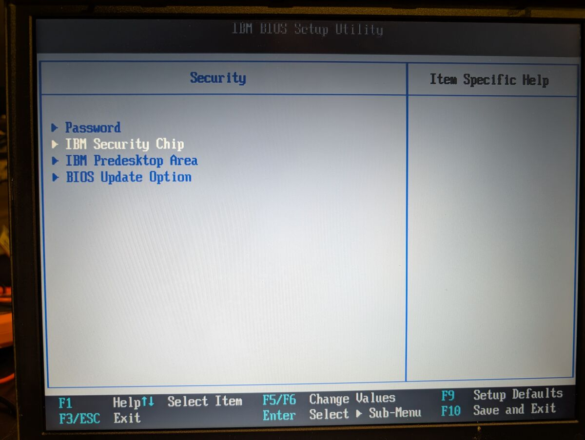

- On the IBM Security Chip page, there is an option to enable or disable the Security Chip. I simply enabled this feature:
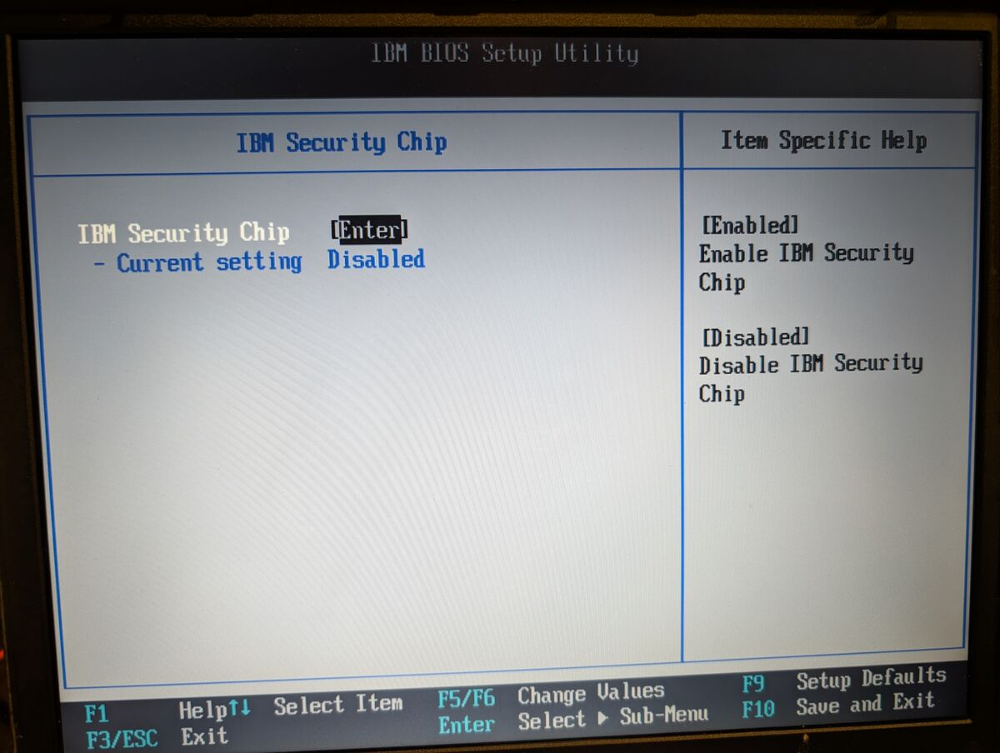

<br>
Whatever the cause, when this lock is engaged, it is because Protection Bits in the APP have been set to 0. This prevents access to protected blocks, and when you try to view them, the output is XX instead of their actual values.

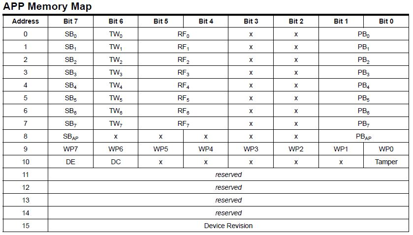
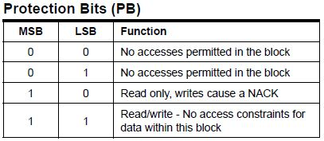

<br>
In EEPROM data when these Protection Bits in the APP are NOT set (i.e. it is "unlocked," like mine was originally), a dump of the APP looks like this:
<br>
<small><i>bash:</i></small>

```bash
sudo i2cdump -y 0 0x5c
```

<small><i>output:</i></small>

```text
     0  1  2  3  4  5  6  7  8  9  a  b  c  d  e  f
00: ae ae ff ff ff ff 83 83 ff ff 7f ff ff ff ff 49
10: 93 07 1d 85 d8 5c 52 38 df 64 63 60 ff ff ff 7f
```

Note how offset 0x06 (which controls access for block 6 where SVP is) is 0x83, which is 10000011 in binary. Last 2 digits (PB bits) are 11 which means "Read/write - No access constraints for data within this block" (from the datasheet).

<br>
In EEPROM data where these Protection Bits in the APP are ENGAGED (i.e. it is "locked," and data at 0x57 is all XX), a dump of the APP looks like this:
<br>
<small><i>bash:</i></small>

```bash
sudo i2cdump -y 0 0x5c
```

<small><i>output:</i></small>

```text
     0  1  2  3  4  5  6  7  8  9  a  b  c  d  e  f
00: ae ae bf bf af af 80 83 ff ff 7f ff ff ff ff 49
10: 93 07 1d 85 d8 5c 52 38 df 64 63 60 ff ff ff 7f
```

In this case at 0x06, it is 0x80 = 10000000 in binary (PB bits are 00 which means "No access permitted in the block").
<br>
This will cause the data at 0x57 to all display as XX.

<br>
<b>HOW TO UNLOCK THE APP: THE PROCESS</b>
<br>
1. Backup the current locked APP (at 0x5c):
<br>
<small><i>bash:</i></small>

```bash
sudo i2cdump -y 0 0x5c > app_locked_backup.txt
```

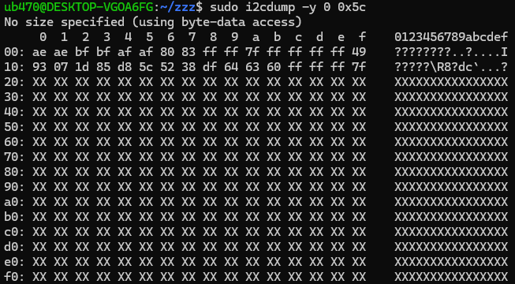<br>
--only worry about the first 32 bytes, not the XXs--

<br>
2. Take careful note of the first 10 bytes (like in above examples 0x00=AE ... 0x09=FF)

<br>
3. Set the first 10 bytes to 0xFF:
<br>
<i>*Note: this will unlock ALL Protection Bits*</i>

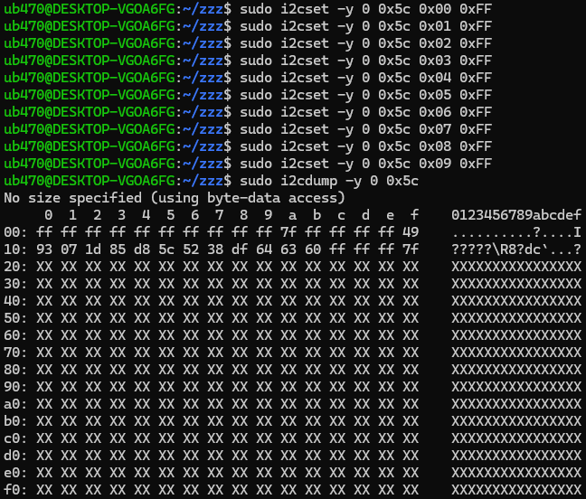<br>
--I show it being done manually here just to better illustrate what is going on. Feel free to write a script--

<br>
4. Block 6 should now be unlocked, dump 0x57 like normal:
<br>
<small><i>bash:</i></small>

```bash
sudo i2cdump -y 0 0x57 > 0x57DUMP.txt
```

<br>
Check the dump to make sure it is no longer all XX. It should look like this:

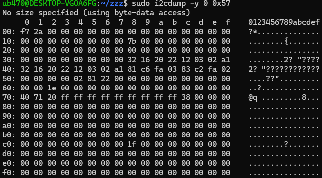

<br>
5. Restore the APP data (the first 10 bytes of your backup in step 1) to their original, locked values:
<br>
<i>WARNING: Not doing so can cause major problems!</i>

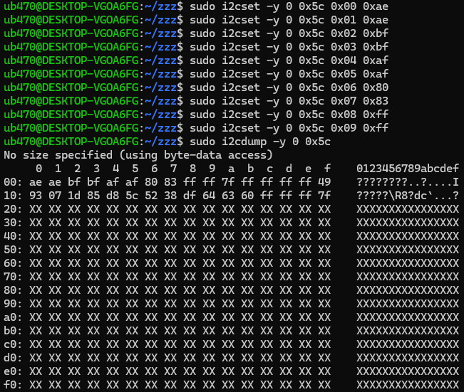

With this done, you can now proceed normally in the main guide at [Step 7.1.4](#714).

---
---

<b id="ap1">Appendix 1 (AP1)</b>
<br>
If your EEPROM chip operates at 1.8V or 5V you will also need a bidirectional logic level converter wired between your programmer and the target EEPROM chip. See [https://learn.sparkfun.com/tutorials/bi-directional-logic-level-converter-hookup-guide/all](https://learn.sparkfun.com/tutorials/bi-directional-logic-level-converter-hookup-guide/all) and also look up more info online.

[[back to 2.2 EEPROM Research]](#22-eeprom-research)

---

<b id="ap2">Appendix 2 (AP2)</b>
<br>
cd changes to the home directory in Linux.
From this point on unless otherwise noted: in WSL, try to operate within the native Linux filesystem (i.e /home/USERNAME which is ext4, and is on a virtual hard disk) instead of the default /mnt/c/Users/USERNAME, which is the Windows filesystem (NTFS). It will be much faster since accessing Windows requires Linux to translate between ext4 and NTFS. Technically, the Windows C drive is being mounted into the system's directory tree, hence "/mnt/c/Users/USERNAME".

[[back to 3.1.2.3 Go to Home directory and clone the specific branch of the kernel source]](#3123-go-to-home)

---

<b id="ap3">Appendix 3 (AP3)</b>
<br>
<small><i>bash:</i></small>

```bash
cd
git clone https://github.com/microsoft/WSL2-Linux-Kernel.git --depth=1 -b linux-msft-wsl-6.6.87.2
```

\--depth=1: Creates a shallow clone by fetching only the latest commit of the repository's history. You get the current files without the gigabytes of previous version history, making the download much faster.
<br>
-b Specifies a branch or tag to clone (linux-msft-wsl-6.6.87.2 in this case)

[[back to 3.1.2.3 Go to Home directory and clone the specific branch of the kernel source]](#3123-go-to-home)

---

<b id="ap4">Appendix 4 (AP4)</b>
<br>
<small><i>bash:</i></small>
<br>

```bash
make -j$(nproc)
```

-j flag sets the number of parallel jobs and $(nproc) returns the total number of logical CPU cores available to the system. This command forces all logical cores to run multiple compilation jobs in parallel.
<br>

[[back to 3.1.3 Compile the Custom Kernel and Modules]](#313-compile-the-custom-kernel)

---

<b id="ap5">Appendix 5 (AP5)</b>
<br>

- I2C (2-Wire) uses only two signal wires: SDA (Data) and SCL (Clock)
- I2C uses an open-drain architecture, devices can only actively pull a signal line LOW; they cannot drive it HIGH. So this process will require one 4.7k Ohm pull-up resistor between SDA and VCC (3.3V, FROM THE EEPROM), as well as one 4.7k Ohm pull-up resistor between SCL and VCC (3.3V FROM THE EEPROM).
- PROT needs to be held HIGH (to VCC) to allow activity on the serial bus (per the datasheet).
- We will be reading this chip using the target PC to power the chip in-circuit, NOT connecting the 3.3V output power from the Pico to the target chip.
- SDA = data
- SCL = serial clock
<br>

[[back to 6. Wire Pico to Test Clip]](#6-wire-pico-to-test-clip)

---

<b id="ap6">Appendix 6 (AP6)</b>
<br>
In retrospect, I would recommend putting the pull-up resistors and wire splices closer to either the male or female ends of the wires instead of the middle since (as you can see) things ended up bending a little awkwardly. Longer wires would definitely make it more convenient but the longer they are, the higher the probability of signal integrity issues, parasitic capacitance, corrupted data, etc.

And remember to put your heat shrink on before you solder your wires...
<br>

[[back to 6. Wire Pico to Test Clip]](#6-test-clip-review)

---

<b id="ap7">Appendix 7 (AP7)</b>

- (-y don't ask for confirmation)
- (-r is read only mode, performs a scan without writing to the I2C bus)
<br>

[[back to 7.1.2 Check Connectivity To Chip]](#712-check-connectivity)

---

<b id="ap8">Appendix 8 (AP8)</b>
<br>
The AT24RF08CN EEPROM has 8 main data blocks (0-7) which are 128 bytes each. *The datasheet refers to memory addresses in their 8-bit address format*, so it says the main data blocks are 0xA8-0xAF, whose 7-bit addresses are 0x54-0x57. However, 2 blocks are stored together at 1 memory address, so each address is actually 256 bytes (2 x 128-byte blocks). They are as follows:

- 7-bit Address 0x54: Contains Block 0 (offsets 0x00–0x7F) and Block 1 (offsets 0x80–0xFF).
- 7-bit Address 0x55: Contains Block 2 (offsets 0x00–0x7F) and Block 3 (offsets 0x80–0xFF).
- 7-bit Address 0x56: Contains Block 4 (offsets 0x00–0x7F) and Block 5 (offsets 0x80–0xFF).
- 7-bit Address 0x57: Contains Block 6 (offsets 0x00–0x7F) and Block 7 (offsets 0x80–0xFF).

There is also:

- an Access Protection Page (APP): a single 16-byte (128 bits) page. This stores the permissions (read/write limits) for the main memory blocks.
- an ID Page: a single 16-byte (128 bits) page. This stores unique identification information for asset tracking.

The APP and ID Pages are stored together at 0xB8 (8-bit address) which is 0x5C (7-bit address).

In total, the chip stores 8448 bits of data. They are located and organized as follows:

- 0x54 - 256 bytes (blocks 0 and 1)
- 0x55 - 256 bytes (blocks 2 and 3)
- 0x56 - 256 bytes (blocks 4 and 5)
- 0x57 - 256 bytes (blocks 6 and 7)
- 0x5C - 32 bytes (APP and ID page)

-----Total: 1056 bytes (8448 bits)-----

<br>
<b>Additional I2C Memory Addresses:</b>
<br>
Using i2cdetect, there also appears to be data at memory addresses 0x30, 0x50, and 0x69. These addresses represent other hardware components sharing the same I2C bus as the Atmel EEPROM chip. Keep in mind I had to have RAM installed in order for the laptop to remain powered on to read the chip. Most likely these addresses are as follows:

- 0x30: DDR SDRAM Write Protection: Typically used for the Write Protection (WP) control of the DDR RAM modules. It is a special register that prevents unauthorized writing to the SPD (Serial Presence Detect) information on the RAM sticks. It ensures that the timing and manufacturer data of the memory cannot be accidentally overwritten or corrupted while the system is running. (JEDEC EE1001/EE1002 specifications for 1K/2K serial EEPROMs used on memory modules, from [https://www.vikingtechnology.com/wp-content/uploads/2021/03/AN0034_SPD_Whitepaper.pdf](https://www.vikingtechnology.com/wp-content/uploads/2021/03/AN0034_SPD_Whitepaper.pdf))
- 0x50: RAM SPD (Serial Presence Detect): This is the EEPROM on the RAM module. It stores the memory's technical specifications (speed, timings, voltage). If there were two sticks of RAM installed, there might even be 0x51 or 0x52 active as well, as each stick occupies its own address in this range. (Intel/JEDEC PC SDRAM Serial Presence Detect (SPD) Specification Rev. 1.2A, from [https://cdn.hackaday.io/files/10119432931296/Spdsd12b.pdf](https://cdn.hackaday.io/files/10119432931296/Spdsd12b.pdf))
- 0x69: Clock Generator or Power Management: On the T40 architecture, 0x69 is most commonly the Clock Generator chip (often an ICS or Cypress brand chip). The clock generator is responsible for synchronizing the timing of the CPU, PCI bus, and other peripherals. ([https://www.renesas.com/en/document/dst/950201-datasheet](https://www.renesas.com/en/document/dst/950201-datasheet) - on datasheet, it says address is D2 (8-bit address) whose 7-bit address is 0x69)

***SIDE NOTE IF PROGRAMMING A BLANK EEPROM CHIP***
<br>
If you ever intend to clone/program an EEPROM chip such as this, make sure you write the main data blocks FIRST, then write the APP/ID section. Otherwise, you run the risk of locking yourself out of the main blocks.
<br>

[[back to 7.1.2 Check Connectivity To Chip]](#712-7bit)

---

<b id="ap9">Appendix 9 (AP9)</b>
<br>
8-bit address vs 7-bit address:
<br>
In I2C communication, an 8-bit address is typically the 7-bit address shifted left by one bit, with the 8th bit (the Least Significant Bit or LSB) serving as the Read/Write flag (0=write, 1=read).

So for 0xA8 and 0xA9:

- 0xA8 (binary 1010 1000) represents the 8-bit write address for a device whose base 7-bit address is 0x54.
- 0xA9 (binary 1010 1001) represents the 8-bit read address for a device whose base 7-bit address is 0x54.

i2ctools (i2cdetect, i2cdump, etc) will automatically handle shifting and setting that 8th bit for you based on whether you call a read or write function, hence you use the 7-bit address.

[[back to 7.1.2 Check Connectivity To Chip]](#712-7bit)

---

<b id="ap10">Appendix 10 (AP10)</b>
<br>
Explaining the .txt dump to .bin command:
<br>
<small><i>bash:</i></small>

```bash
cat 0x57DUMP.txt | awk '/^[0-9a-f]0:/{for(i=2;i<=NF;i++) if($i ~ /^[0-9a-fA-F]{2,4}$/) printf "%s", $i} END{print ""}' | xxd -r -p > 0x57DUMP.bin
```

This command reads out (concatenates, aka cat) 0x57DUMP.txt, the puts that output through awk (to extract data from specific fields), regular expressions, and xxd together to strip headers or sidebar text and convert the hex to raw binary, which is needed for ibmpass2.2Lite, ibmsupervisor, or my script/program ibmSVP_scanDecoder.

The code between the slashes /^[0-9a-f]0:/ is a regex constant. It filters the input file to find lines that match a specific structure.

^: Asserts the match must start at the beginning of a line.

[0-9a-f]: Matches exactly one hexadecimal character (0-9 or a-f)

AWK automatically splits each line into fields (columns) based on whitespace. $2 is the second column, $3 the third, and so on.

for(i=2;i<=17;i++) iterates 16 times to grab columns 2 through 17.

i<=NF (Number of Fields) ensures you catch all data regardless of whether a line has 16 bytes or fewer.

The if($i ~ /^[0-9a-fA-F]{2,4}$/) check ensures that only hex digits are passed to xxd, skipping any ASCII sidebars (Hex-only filter).

printf "%s " adds a space after every byte.

The xxd command is used for the actual conversion back to binary.

-r (Revert): Tells xxd to do the reverse of a hex dump, converting hex characters into their original raw binary form.

-p (Plain/Postscript): Informs xxd to expect a "plain" stream of hex digits without line numbers or ASCII sidebars.

[[back to 7.2 Convert Dump (.txt) to Raw Binary (.bin)]](#72-convert-dump-txt-to-raw-binary-bin)

---

<h2>Miscellaneous Problems and Notes</h2>

I did not originally have to unlock the APP, but then I found [https://forum.reveltronics.com/viewtopic.php?t=292](https://forum.reveltronics.com/viewtopic.php?t=292) and wondered what it was all about. I was able to get my chip to enter this locked state, and thus the Access Protection Page section was born. Also it is entirely plausible that in many cases, the block containing the SVP data could be locked, and in that case this info is important.

---

Originally the first time I compiled my own custom kernel and modules, my bzImage was 0 bytes and I had compile errors. The computer I was working on was just an old T470 I had lying around, only 8GB RAM, a dual-core Intel CPU, running Windows 11 (unsupported of course); I suspected it ran out of memory. So I had to set compile specs:

<div style="margin-left: 2em;">
Create a WSL Configuration file ("C:\Users\T470\.wslconfig") with the following data inside:

<div style="margin-left: 2em;">
<br>
<small><i>C:\Users\T470\.wslconfig:</i></small>

```text
[wsl2]
memory=4GB
processors=3
swap=12GB

[experimental]
autoMemoryReclaim=gradual
```

</div>
</div>
Then I was able to compile my kernel and everything was ok.

---

<b id="poweringeeprom">Powering the EEPROM Chip</b>

Originally I had a lot of trouble actually getting the Pico to read or detect the EEPROM. Also, at first, my plan was to use the Pico to supply 3.3V to the EEPROM chip. Note how in the guide however, I say to let the target laptop power the EEPROM chip. This will be important in a few paragraphs.

From my SPI programming project I knew that wiring an in-circuit chip to a Raspberry Pi Pico with jumper wires an a test clip can be a little janky. In that process, I had to lower the speed in order to read the SPI flash chip. So of course that is the first thing I tried.

This required going into the I2C-Pico-USB code to change it to operate at 50kHz instead of 100kHz. I then recompiled it and flashed it to the Pico but had the same inability to read/detect the EEPROM.

I actually took a break for a couple of days at this point. I had read that this chip requires some unusual variation of START or ACK commands which differ from other EEPROM chips and thought there could be some unusual compatibility issues with i2ctools.

But then I entered into "just fiddle with it and not write it down" mode. I tried connecting the WP pin (Write Protect) to VCC (which would have been read-only, preventing writes), tried tying it to GND (which would allow writes), then disconnected it altogether and none of it made any difference. So I just left it disconnected, which is why I never mentioned it.

I somehow figured out that the Pico wasn't even being recognized by the host PC when the test clip was connected to the EEPROM. Then I discovered it WOULD be recognized if the test clip was disconnected. Both my modified 50kHz version as well as the original I2C-Pico-USB firmware behaved this way.

In the back of my mind I knew there are always inherent risks/problems with in-circuit programming. Like backfeeding. Which turned out to be exactly what the problem was. Using a multimeter, I checked voltage between VCC to GND of the Pico with it plugged into the host PC and the test clip disconnected: 3.3V. Then I tested it with the test clip connected: around 50mV and jumping all around.

What was happening was the programmer (Pico) was backfeeding current into the main power rail of the target PC's motherboard, drawing too much current, and triggering the host-PC's USB Overcurrent Protection (OCP), thus not being detected. The Raspberry Pi Pico lacks a built-in current-limiting fuse or smart "overcurrent protection" circuit on its power rails.

So I removed the connection between the Pico and the EEPROM VCC pin (you can see it dangling in some of the pics), but left the EEPROM VCC attached to the test clip (SCL and SDA still needed to be pulled up to 3.3V and PROT still needed to be tied HIGH) and decided to try it by letting the target PC power the EEPROM. This is what finally worked.

[[back to 6. Wire Pico to Test Clip]](#6-wire-pico-to-test-clip)

---

<b>Failed Attempts at .txt to .bin commands (and regex...)</b>

This was my first attempt at a command to convert a .txt hex dump to binary:
<br>
<small><i>(OLD COMMAND)bash:</i></small>

```bash
cat input.txt | awk '/^[0-9a-f]0:/{for(i=2;i<=17;i++) printf "%s ", $i}' | xxd -r -p > output.bin
```

This did not always work correctly. It would sometimes shift the data by a few bytes, resulting in my SVP starting at 0x35 instead of 0x38.

---

<script>
  document.title = "IBM ThinkPad SVP Retrieval";
</script>
