<!-- markdownlint-disable MD002 MD025 MD033 MD041 -->
<link rel="stylesheet" href="../style.css">

<h1>Lenovo ThinkPad Supervisor Password Removal</h1>
<h2>(2012-2018, 4th to 8th-gen Intel)</h2>

<b>NthTry99</b><br>December 2025 (Revised April 2026)

<div class="image-row">
  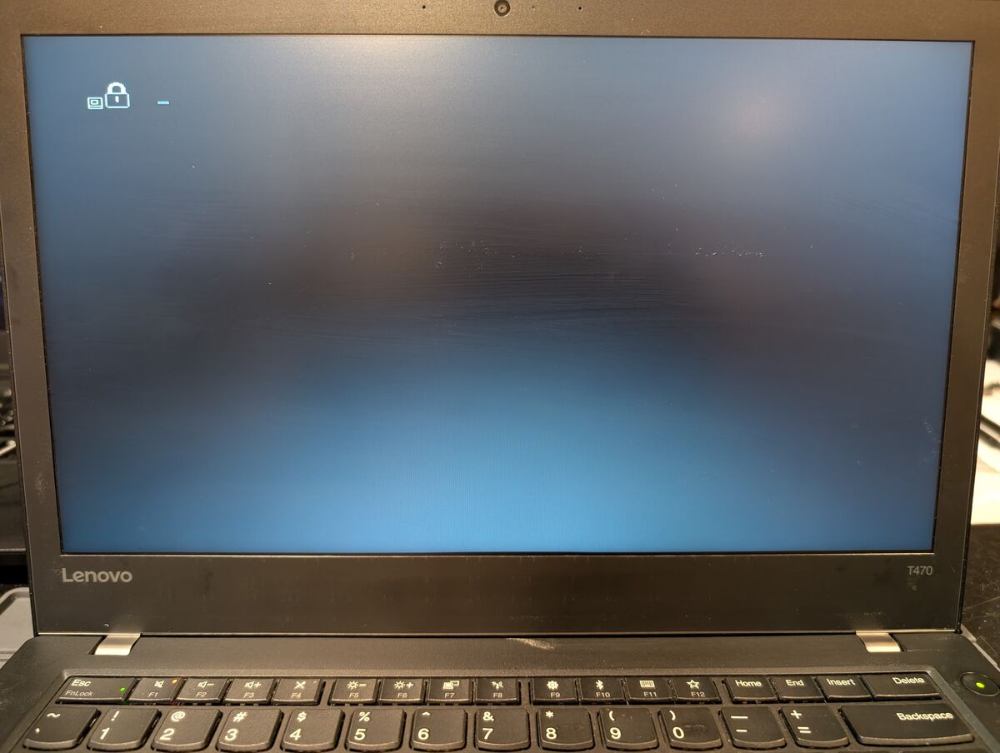
  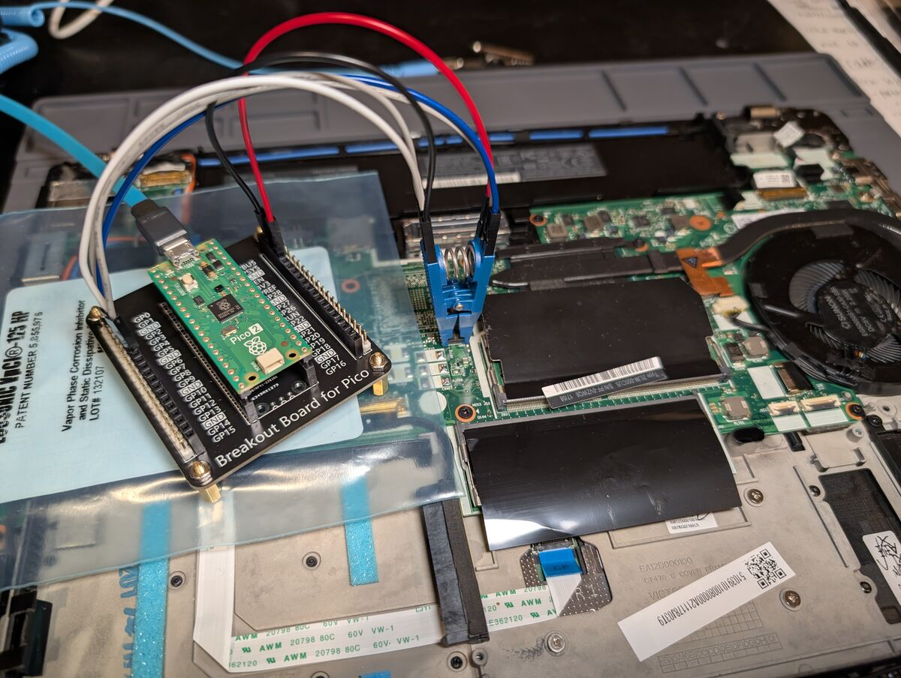
</div>

<h2>Table of Contents</h2>

- [1. Project Summary](#1-project-summary)
  - [1.1 Objective and Background Info](#11-objective-and-background-info)
  - [1.2 Process Overview](#12-process-overview)
- [2. Preparation and Research](#2-preparation-and-research)
  - [2.1 Disassembly](#21-disassembly)
  - [2.2 Locate SOIC-8 Chips](#22-locate-soic-8-chips)
  - [2.3 Confirm BIOS Chip](#23-confirm-bios-chip)
- [3. Host-PC and Pico2 Configurations](#3-host-pc-and-pico2-configurations)
  - [3.1 Install flashprog on Host PC](#31-install-flashprog-on-host-pc)
  - [3.2 Download pico-serprog Firmware](#32-download-pico-serprog-firmware)
  - [3.3 Flash pico\_serprog.uf2 to Pico2](#33-flash-pico_serproguf2-to-pico2)
- [4. Wire Pico2 to Test Clip](#4-wire-pico2-to-test-clip)
  - [4.1 BIOS Chip/Test Clip Connections](#41-bios-chiptest-clip-connections)
  - [4.2 Pico2 Connections](#42-pico2-connections)
  - [4.3 Attach Jumper Wires](#43-attach-jumper-wires)
- [5. Obtain the BIOS](#5-obtain-the-bios)
  - [5.1 Attach Test Clip to BIOS Chip](#51-attach-test-clip-to-bios-chip)
  - [5.2 Identify Pico2's Device Node](#52-identify-pico2s-device-node)
  - [5.3 Read/Dump BIOS](#53-readdump-bios)
  - [5.4 Compare the BIOS Reads](#54-compare-the-bios-reads)
- [6. Patch the BIOS](#6-patch-the-bios)
  - [6.1 Download the Autopatcher](#61-download-the-autopatcher)
  - [6.2 Prepare the Autopatch Script](#62-prepare-the-autopatch-script)
  - [6.3 Run the Autopatch Script](#63-run-the-autopatch-script)
- [7. Write Patched BIOS](#7-write-patched-bios)
  - [7.1 Verify Connection Integrity](#71-verify-connection-integrity)
  - [7.2 Flash Patched BIOS to Chip](#72-flash-patched-bios-to-chip)
  - [7.3 Ensure the Write Integrity](#73-ensure-the-write-integrity)
  - [7.4 Disconnect Programmer/Test Clip](#74-disconnect-programmertest-clip)
- [8. Boot Patched BIOS](#8-boot-patched-bios)
  - [8.1 Partially Reassemble Laptop](#81-partially-reassemble-laptop)
  - [8.2 Power On and Boot "Patched" BIOS](#82-power-on-and-boot-patched-bios)
  - [8.3 Disconnect Power and Re-Disassemble](#83-disconnect-power-and-re-disassemble)
- [9. Restore Original, Unpatched BIOS](#9-restore-original-unpatched-bios)
  - [9.1 Reconnect Test Clip to BIOS Chip](#91-reconnect-test-clip-to-bios-chip)
  - [9.2 Verify Connection Integrity](#92-verify-connection-integrity)
  - [9.3 Restore Original BIOS to Chip](#93-restore-original-bios-to-chip)
  - [9.4 Verify the Write](#94-verify-the-write)
  - [9.5 Disconnect Programmer/Test Clip](#95-disconnect-programmertest-clip)
- [10. Confirmation and Reassembly](#10-confirmation-and-reassembly)
  - [10.1 Verify SVP Removal](#101-verify-svp-removal)
  - [10.2 Reset BIOS Settings to Factory Defaults](#102-reset-bios-settings-to-factory-defaults)
  - [10.3 Reassemble Laptop](#103-reassemble-laptop)

---

- [Appendix 1: Compatible Laptops](#appendix-1-compatible-laptops)
- [Appendix 2: Note on Linux](#appendix-2-note-on-linux)
- [Appendix 3: Standard UEFI Platform Initialization (PI) Flow](#appendix-3-standard-uefi-platform-initialization-pi-flow)
- [Appendix 4: The Embedded Controller (EC)](#appendix-4-the-embedded-controller-ec)
- [Appendix 5: Normal SVP Verification Process](#appendix-5-normal-svp-verification-process)
- [Appendix 6: How Modified DXE Driver Exploit Works](#appendix-6-how-modified-dxe-driver-exploit-works)
- [Appendix 7: Why This Doesn't Work for Newer Laptops](#appendix-7-why-this-doesnt-work-for-newer-laptops)
- [Appendix 8: History of DXE Driver Exploit](#appendix-8-history-of-dxe-driver-exploit)
- [Appendix 9: Role of the Injected Drivers](#appendix-9-role-of-the-injected-drivers)
- [Appendix 10: Problems and Notes 1](#appendix-10-problems-and-notes-1)
- [Appendix 11: Problems and Notes 2](#appendix-11-problems-and-notes-2)

---

## <a id="1-project-summary"></a>1. Project Summary

### <a id="11-objective-and-background-info"></a>1.1 Objective and Background Info

This document describes a process to remove a lost/unknown Supervisor Password (SVP, aka BIOS password) from Lenovo ThinkPads, from approximately between the years 2012-2018 (4th to 8th-gen Intel). Specifically, I will be using a Lenovo ThinkPad T470 (circa 2017). See [Appendix 1: Compatible Laptops](#appendix-1-compatible-laptops) for a list of ThinkPad models known to work with this process.

To really understand what is happening, it helps to be semi-familiar with the early boot process of these laptops. For a summarization, see [Appendix 3: Standard UEFI Platform Initialization (PI) Flow](#appendix-3-standard-uefi-platform-initialization-pi-flow).

For a description of the normal Supervisor Password verification process, see [Appendix 5: Normal SVP Verification Process](#appendix-5-normal-svp-verification-process).

Unlike previous generations of ThinkPads where the SVP was literally stored as translatable scancodes on an SOIC-8 EEPROM chip, these models use a more complex Embedded Controller (EC) chip to store a hash of the password in a protected area of its memory (NVRAM) which cannot practically be accessed or modified directly. For more information on this chip, see [Appendix 4: The Embedded Controller (EC)](#appendix-4-the-embedded-controller-ec).

### <a id="12-process-overview"></a>1.2 Process Overview

To date, the most efficient way to remove a Supervisor Password for these ThinkPad models is by utilizing a firmware-level software exploit within the BIOS (which is stored on its own chip) and taking advantage of its relationship with the EC.

First, the complete BIOS (technically the UEFI firmware) is dumped/read from the chip via an external programmer. Using a script, the BIOS is modified in a way which will clear the password when booted. This modified firmware is then flashed back to the chip and subsequently executed, allowing it to clear the password. The original firmware is then re-flashed back to the chip and the process is complete. For more details see [Appendix 6: How Modified DXE Driver Exploit Works](#appendix-6-how-modified-dxe-driver-exploit-works).

For a brief history of the exploit, see [Appendix 8: History of DXE Driver Exploit](#appendix-8-history-of-dxe-driver-exploit).

For a brief explanation of how this vulnerability was fixed in later generations, see [Appendix 7: Why This Doesn't Work for Newer Laptops](#appendix-7-why-this-doesnt-work-for-newer-laptops).

---

***DISCLAIMER: I am not responsible for any damage caused by, or misuse of, the information in this document. This document is purely for educational/informational purposes in the context of security research.***

***I also take no credit for the creation of any tools, physical or digital, used in this guide. The physical tools are cheap and widely available, and all of the software/code used is either FOSS (Free and Open-Source Software) or otherwise freely available to download on the internet. Throughout this guide, I have tried my very best to give credit to the creators of any code, packages, scripts, etc and provide sources, websites, or direct URLs from which they were obtained.***

***This guide assumes some general knowledge of hardware, electronics, and Linux concepts, terminology, and commands. If you decide to try this and there is anything you do not understand in this document, be sure to ask or look it up prior to starting!***

---

## <a id="2-preparation-and-research"></a>2. Preparation and Research

Before beginning, make sure your ThinkPad is one of the compatible models for this process. For a list, see [Appendix 1: Compatible Laptops](#appendix-1-compatible-laptops).

<b>PARTS/FILES NEEDED:</b>

- Raspberry Pi Pico (or Pico2) with headers
- Breakout board or breadboard
- Jumper wires (x6)
- a USB-A to Micro-USB cable
- an SOIC-8/SOP-8 test clip (Pomona 5250 is the fancy one, but cheap ones from Amazon will probably work)
- lenovo_autopatcher_0.2.zip
  - available on badcaps.net [(Knucklegrumble, Source 1)](#source1)
  - direct download link: [https://www.badcaps.net/filedata/fetch?id=3166264](https://www.badcaps.net/filedata/fetch?id=3166264) (might need to create a badcaps.net account)
  - see [Source 7](#source7) for alt source
- a computer running Linux (see [Appendix 2: Note on Linux](#appendix-2-note-on-linux))
- an internet connection

### <a id="21-disassembly"></a>2.1 Disassembly

Once you have gathered all the required parts/files, ensured your laptop's compatibility, and you know what you are doing, it's time to locate and identify your BIOS chip. Don't be afraid to look online first for info/suggestions about its location; you still may have to hunt for it. It will be an SOIC-8/SOP-8 chip (probably Macronix or Winbond).

<b>Disassemble the laptop (gain access to BIOS chip):</b>

- Remove the external battery and unplug the power adapter.
- Remove the bottom screws and cover.
- Disconnect/remove the internal battery, SSD/HDD, and CMOS battery.
- Press and hold the power button for 30 seconds to discharge any residual power.

### <a id="22-locate-soic-8-chips"></a>2.2 Locate SOIC-8 Chips

Locate all SOIC-8 chips on the laptop motherboard.
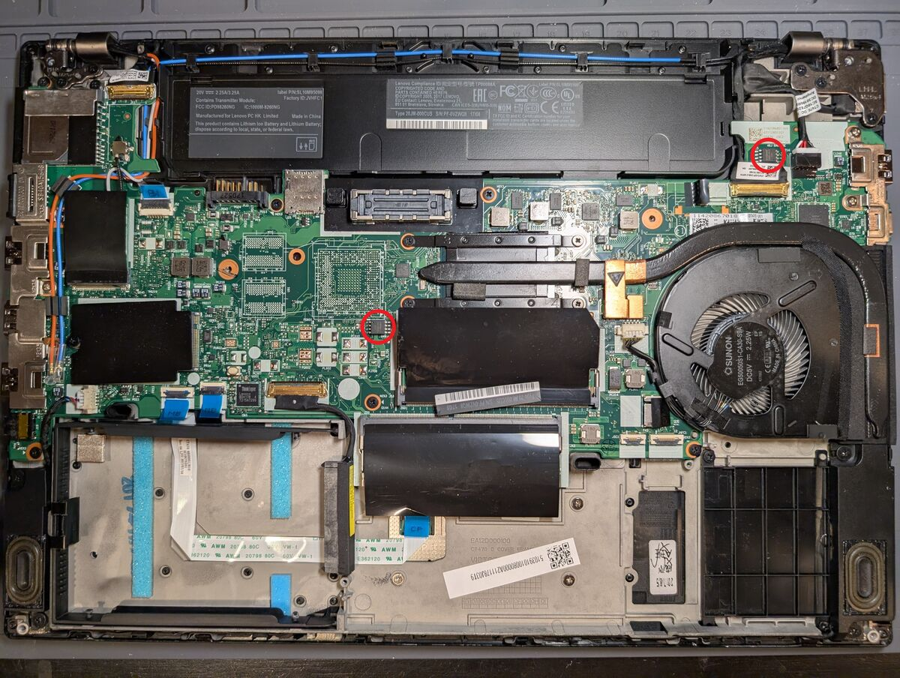

Some laptops have more than one of these chips.

<br>
<b>My SOIC-8 Chips Details:</b>
<div style="margin-left: 2em;">
<b>"Front/RAM/Center" chip:</b>

- At location U49, right next to one of the RAM slots
- Winbond 25Q128FVSQ
- Page 5 of datasheet: 2.7-3.6V supply, W25Q128FV: 128M-bit / 16M-byte
- This is my BIOS (UEFI firmware) chip:
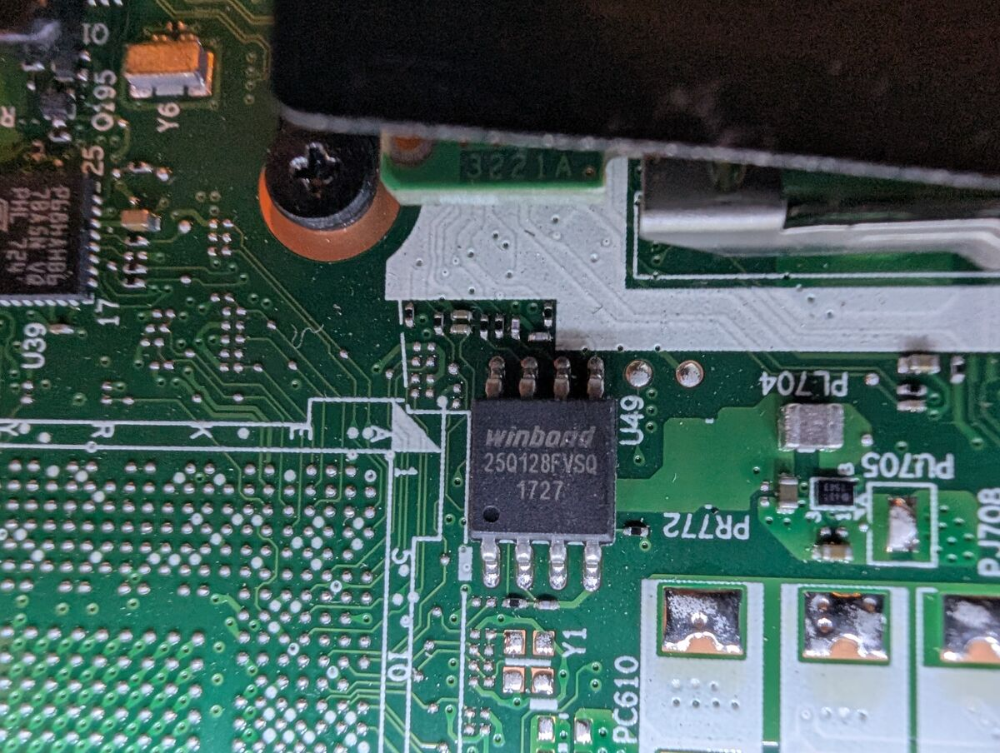

<b>"Rear/CMOS battery" chip:</b>

- At location U15, right by CMOS battery
- Winbond 25Q80JVSIQ
- Page 4 of datasheet: 2.7-3.6V supply, W25Q80JV: 8M-bit / 1M-byte (1,048,576)
- This is not the BIOS chip; the BIOS will be bigger than 1MB
- Most likely the Thunderbolt 3 firmware chip:
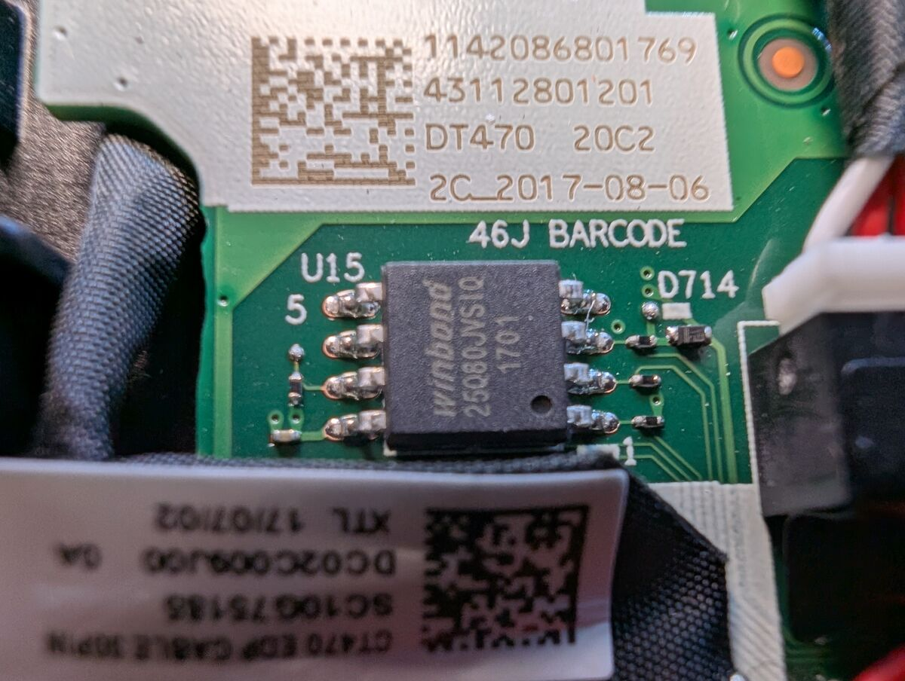

</div>

### <a id="23-confirm-bios-chip"></a>2.3 Confirm BIOS Chip

If there are multiple SOIC-8 chips, to verify which is the BIOS/UEFI chip, look at the top side marking on these chips and look up their datasheets on their manufacturer's website. The one that stores the BIOS will almost always store more memory, such as 128M-bit / 16M-byte. Here are some relevant specs for my Winbond 25Q128FVSQ chip [(Winbond, Source 2)](#source2):

- SERIAL FLASH MEMORY
- 128M-bit / 16M-byte
  - this is the important part, the BIOS is usually 16MB
- Single 2.7 to 3.6V supply
- 104MHz Single, Dual/Quad SPI clocks

NOTE: the input voltage is important! Most of these flash chips will take an input range of 2.7-3.6V, however some use 1.8V. The Raspberry Pi Pico/Pico2 outputs 3.3V so we are good. Some programmers will use different voltages. Specifically, be careful with the CH341A. While the output to the VCC is typically 3.3V, they are known to output 5V to the SPI data lines.

---

## <a id="3-host-pc-and-pico2-configurations"></a>3. Host-PC and Pico2 Configurations

Regarding the PC/Pico2 configurations, here is generally what is going on:

-The host PC will be running a utility called flashprog (an improved fork of flashrom) and connects to the Raspberry Pi Pico2 via USB using serial protocol. The Pico talks to the target flash chip via SPI interface (using 4 GPIO pins as SPI lines), and of course the 3.3V power and ground from the Pico2.

-The Raspberry Pi Pico2 will be running pico-serprog, which is firmware that turns it into a serprog programmer. Serprog is a simple, open-source, serial communication protocol designed specifically for flash ROM programming.

### <a id="31-install-flashprog-on-host-pc"></a>3.1 Install flashprog on Host PC

<small><i>bash:</i></small>

```bash
sudo pacman -S flashprog
```

<i>flashprog is in the Extra repository on Arch-based distributions, and in the Universe repository on Ubuntu-based distributions. Check your distribution and make sure the appropriate repository is enabled so you can find the package.</i>

### <a id="32-download-pico-serprog-firmware"></a>3.2 Download pico-serprog Firmware

Make sure cmake (Extra), pico-sdk (AUR) , and picotool (AUR) are installed. If not, install them.

<br>
Add environment variable for pico-sdk (this is needed to compile pico-serprog):
<br>
<small><i>bash:</i></small>

```bash
echo "export PICO_SDK_PATH=/usr/share/pico-sdk" >> ~/.bashrc
```

<br>
Download and compile the source code to your desired directory:
<br>
<small><i>bash:</i></small>

```bash
git clone https://codeberg.org/Riku_V/pico-serprog.git .
cmake . -DPICO_BOARD=pico2
make .
```

This will generate a bunch of files in that directory, one being "pico_serprog.uf2". This is the firmware we will flash to the Pico2.

<i>NOTE: If using a 1st gen Pico (not Pico2), do not add "-DPICO_BOARD=pico2" in the cmake command above</i>

### <a id="33-flash-pico_serproguf2-to-pico2"></a>3.3 Flash pico_serprog.uf2 to Pico2

Hold the BOOTSEL button (on the Pico2) down while plugging it into the host PC via USB. When the computer recognizes it as "RP2350" (or "RP2040" for original Pico), release the button. <i>(Note: it is easier to plug the micro-USB into the Pico2 first, then the USB-A into the host PC while holding the button)</i>

Copy the "pico_serprog.uf2" file to the root directory of the Pico2. There will probably already be 2 files there, INDEX.HTM and INFO_UF2.TXT, just leave them there.

The Pico2 should reboot. It will automatically unmount and display as "`libreboot.org pico-serprog (pico2)`". The new firmware has been installed. To verify this:
<br>
<small><i>bash:</i></small>

```bash
lsusb
```

and among the output you should see something like:
<br>

```text
Bus 001 Device 012: ID cafe:4001 libreboot.org pico-serprog (pico2)
```

Disconnect the Pico2 from the host computer.

---

## <a id="4-wire-pico2-to-test-clip"></a>4. Wire Pico2 to Test Clip

Next we will wire the Pico2 to the SOIC-8/SOP-8 test clip:
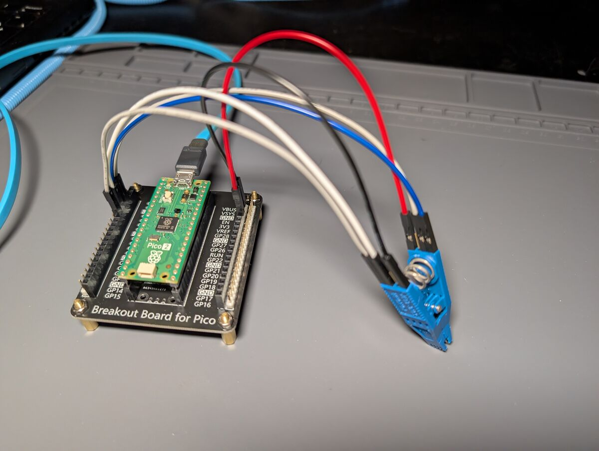

I recommend using a breakout board (or breadboard) and wiring it to the test clip, then attaching the Pico2 to the breakout board. DO NOT ATTACH THE TEST CLIP TO THE BIOS CHIP YET.

### <a id="41-bios-chiptest-clip-connections"></a>4.1 BIOS Chip/Test Clip Connections

Identify the pinout for the BIOS chip from the datasheet [(Winbond, Source 2)](#source2):

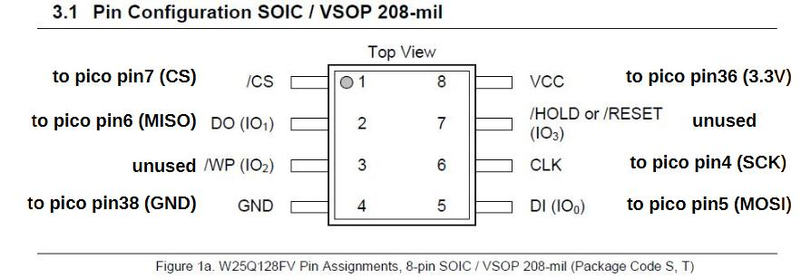
<br>
NOTE: the small round notch on the corner of the chip indicates pin 1.

### <a id="42-pico2-connections"></a>4.2 Pico2 Connections

Here is the pinout for the SPI lines on the Pico2 (for use with Riku_V's pico-serprog, borrowed directly from that page). [(Riku_V, Source 3)](#source3):
<br>
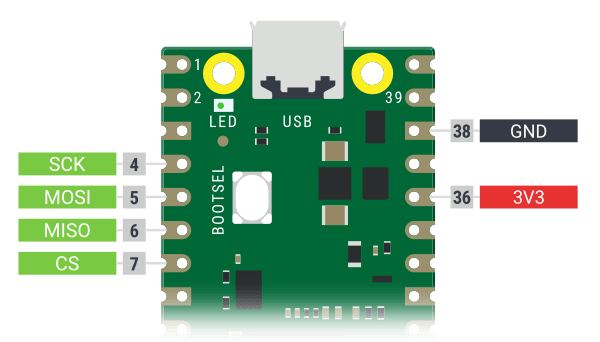
<br>
NOTE: You MUST follow the pinout configuration on the specific version of pico-serprog you flashed. There is another popular version, by Stacksmashing [(Stacksmashing, Source 4)](#source4), which is the upstream repository and uses a different pinout.

### <a id="43-attach-jumper-wires"></a>4.3 Attach Jumper Wires

Physically attach jumper wires from the corresponding pins on the test clip (and where they will connect on the BIOS chip) to the pins on the breakout board (where they match up on the Pico2).

INFO: Here is a quick SPI communication line recap:
<br>
**--WARNING: USING LEGACY TERMINOLOGY FROM DATASHEET, DO NOT GET MAD AT ME--**

- CS (Chip Select): This is a dedicated control line used by the master device (our Pico2) to enable a specific slave device (our BIOS chip) for communication (this is kind of like an "enable" line). This is also sometimes called SS (Slave Select).
- MISO (Master In, Slave Out): Data flows from the slave's output pin to the master's input pin.
- MOSI (Master Out, Slave In): Data flows from the master's output pin to the slave's input pin.
- CLK (Serial Clock): The master generates the clock signal to synchronize the data transfer. (aka SCLK/SCK)
- 3.3: the 3.3V power line
- GND: ground line

---

## <a id="5-obtain-the-bios"></a>5. Obtain the BIOS

<b>-- Make sure the power adapter and all batteries are still disconnected from the target laptop --</b>

### <a id="51-attach-test-clip-to-bios-chip"></a>5.1 Attach Test Clip to BIOS Chip

Carefully attach the test clip to the BIOS chip. Be sure the clip is fully, evenly seated all the way down on the chip and that you have the correct pin orientation. Remember pin 1 is indicated by the small round notch on the top of the chip.
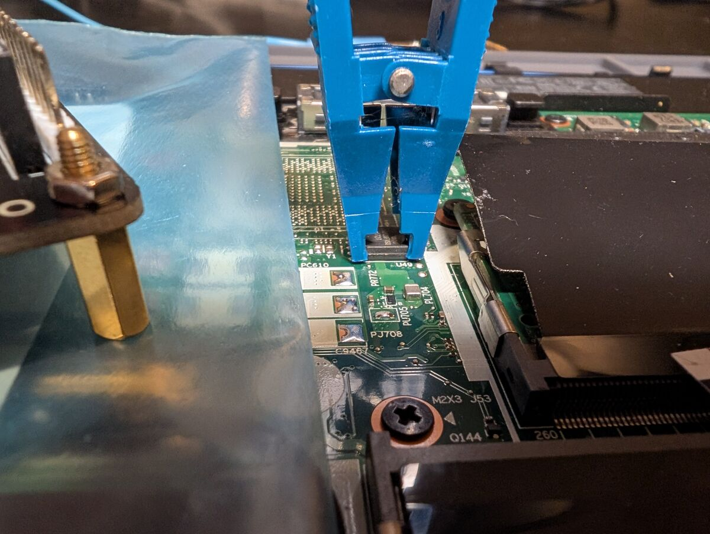

### <a id="52-identify-pico2s-device-node"></a>5.2 Identify Pico2's Device Node

In a terminal, run:
<br>
<small><i>bash:</i></small>

```bash
sudo dmesg -wH
```

While dmesg is running, connect the Pico2 to the host PC. A new line should appear with something like:
<br>

```text
[  +0.003208] cdc_acm 1-1:1.0: ttyACM0: USB ACM device
```

At very bottom of full output:
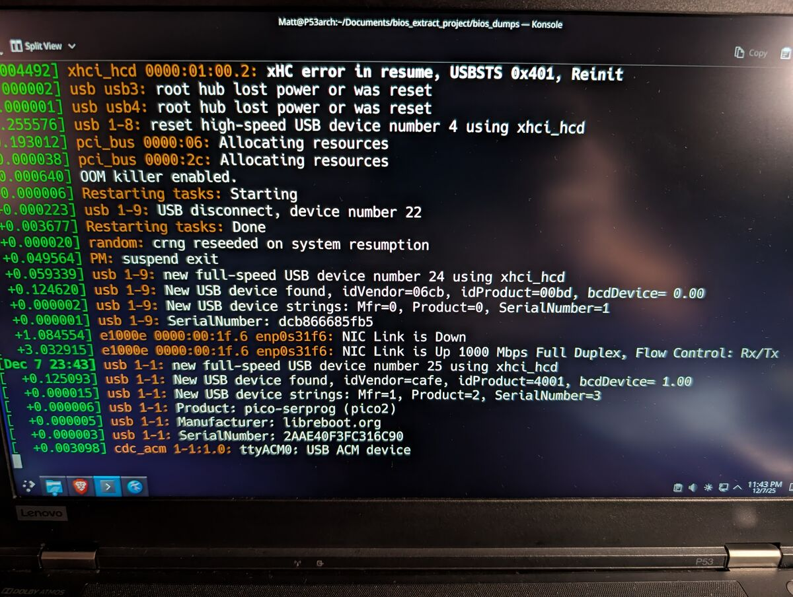

Take note of the "ttyACM0" or whatever the Pico2 displays as (it will be the line that appeared when you plugged in the Pico2); it should start with "ttyACM". This is our Pico2's device node, which is what the Linux Kernel will refer to it as. We will need this when using the flashprog command. Once you have this written down, use CTL+C to stop dmesg.

### <a id="53-readdump-bios"></a>5.3 Read/Dump BIOS

Create (and navigate to) a new directory to work out of. This is where the BIOS dump will be saved.

READ the contents of the chip (insert your device node from 5.2 if it is not ttyACM0):
<br>
<small><i>bash:</i></small>

```bash
sudo flashprog -p serprog:dev=/dev/ttyACM0,spispeed=10M -r flash.bin
```

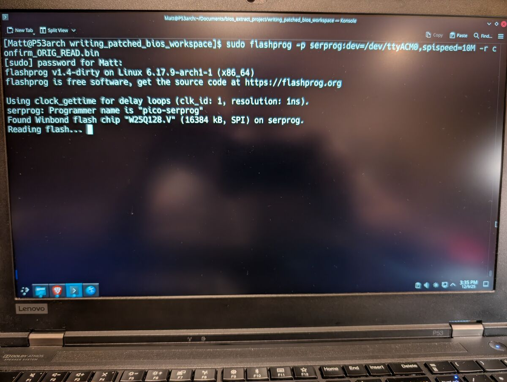

READ the chip several more times, making sure to change the output filename (flash.bin) for each additional read to avoid overwriting previous dumps. We will perform multiple redundant reads throughout this process and will be comparing them; this is to ensure we are getting consistent and accurate data from the chip.

At first I had trouble with reading and the connection. For details, see [Appendix 10: Problems and Notes 1](#appendix-10-problems-and-notes-1).

### <a id="54-compare-the-bios-reads"></a>5.4 Compare the BIOS Reads

Use a binary comparison to ensure they are all identical. For example, to compare two files:
<br>
<small><i>bash:</i></small>

```bash
cmp flash1.bin flash2.bin
```

---OR---

You can compare the checksums (MD5 for example) of multiple files. For the sake of data integrity, if they are the same, the files are the same:
<br>
<small><i>bash:</i></small>

```bash
md5sum flash1.bin flash2.bin flash3.bin
```

If all of the dumps/reads from the chip are identical, you can be confident your connections/wires are reliable and you have the true contents of the flash chip.

**THIS IS YOUR FACTORY, ORIGINAL BIOS. BACK IT UP. MULTIPLE TIMES. DO NOT LOSE IT!**

---

## <a id="6-patch-the-bios"></a>6. Patch the BIOS

To remove the SVP, we will modify our BIOS/firmware in a way where it will actually clear the password by itself. To do this, we will run the Autopatch script on our BIOS, which injects it with modified DXE drivers (aka "patching" it). These modified drivers exploit a vulnerability which facilitates bypassing/removing the supervisor password.

We will flash this patched BIOS back to the chip and run it, allowing it to remove the supervisor password. Once the password has been removed, we will flash our original, unpatched BIOS back onto the target laptop and we will be finished. NOTE: the patched BIOS is only used to remove the password and must be replaced with the original BIOS afterward to restore the laptop's functionality.

Here is a brief explanation directly from the creator of the Autopatch script:

<i>"The autopatcher has 2 steps. On the first pass it injects the patched DXE drivers. If the bios is from an older gen it ends there and its work is done. If it's a newer generation on the second pass it replaces parts of the NVRAM with clean ones and then it's done."</i> [(Knucklegrumble, Source 6)](#source6)

### <a id="61-download-the-autopatcher"></a>6.1 Download the Autopatcher

Download lenovo_autopatcher_0.2.zip from [Source 1](#source1) or [Source 7](#source7).

Also, make sure you have Python installed:
<br>
<small><i>bash:</i></small>

```bash
sudo pacman -S python
```

### <a id="62-prepare-the-autopatch-script"></a>6.2 Prepare the Autopatch Script

Create (and navigate to) a new directory containing a copy of your BIOS (ex. flash.bin or bios.bin) as well as the extracted files from the lenovo_autopatcher_0.2.zip. In total, your directory should contain:

- patch/ (directory)
- tools/ (directory)
- autopatch (this is the script we will be using)
- autopatch.cmd (for Windows, we won't use this)
- bios.bin (your BIOS you just read)

<br>
Add execute permission for the autopatch script:
<br>
<small><i>bash:</i></small>

```bash
chmod +x autopatch
```

<br>
Add execute permission for UEFIReplace (which is an included utility called upon in the script):
<br>
<small><i>bash:</i></small>

```bash
chmod +x ./tools/UEFIReplace
```

### <a id="63-run-the-autopatch-script"></a>6.3 Run the Autopatch Script

Now execute the script:
<br>
<small><i>bash:</i></small>

```bash
./autopatch bios.bin
```

<br>
It should generate output similar to:
<br>
<small><i>output:</i></small>

```text
Using UEFIReplace to inject 2 DXE drivers...
[1/2] LenovoTranslateService (GUID 826bcf56-bac4-43f4-8ea1-8cdf0a121abd)
[2/2] BootOption (GUID e0746c42-d3f9-4f8b-b211-1410957b9ff5)

Looking for volumes to patch...
[1/1] NVRAM_EfiSystemNvDataFvGuid (checksum 2609h):
      Found volume at offset 800000h (checksum 2609h)
      Replacing volume.

Done.

PATCH FILE: bios_PATCHED.bin

Good luck.
```

After running the script, you should have an additional, _PATCHED version of your BIOS in your working directory. (i.e bios_PATCHED.bin)

For more info about DXE drivers and these modified drivers injected here by the script, see [Appendix 9: Role of the Injected Drivers](#appendix-9-role-of-the-injected-drivers).

If you get an error, you may have forgotten to add execute permission to either the script or UEFIReplace like I did. For details, see [Appendix 11: Problems and Notes 2](#appendix-11-problems-and-notes-2).

---

## <a id="7-write-patched-bios"></a>7. Write Patched BIOS

Create (and navigate to) a new directory to work out of. Make sure a copy of the original BIOS and patched BIOS are in it.

### <a id="71-verify-connection-integrity"></a>7.1 Verify Connection Integrity

READ the chip again:
<br>
<small><i>bash:</i></small>

```bash
sudo flashprog -p serprog:dev=/dev/ttyACM0,spispeed=10M -r confirm_ORIG_READ.bin
```

Compare it to the original BIOS dumps. If they match, you have a solid connection.

### <a id="72-flash-patched-bios-to-chip"></a>7.2 Flash Patched BIOS to Chip

WRITE the patched BIOS to the chip. NOTE: the write command will automatically erase the chip then write to it.
<br>
<small><i>bash:</i></small>

```bash
sudo flashprog -p serprog:dev=/dev/ttyACM0,spispeed=10M -w T470bios_PATCHED.bin
```

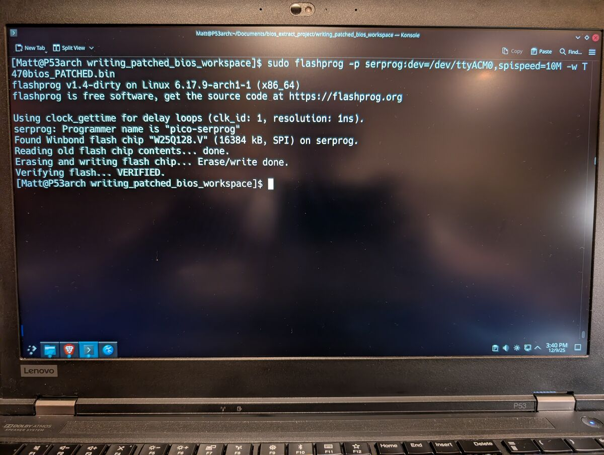

### <a id="73-ensure-the-write-integrity"></a>7.3 Ensure the Write Integrity

READ the chip:
<br>
<small><i>bash:</i></small>

```bash
sudo flashprog -p serprog:dev=/dev/ttyACM0,spispeed=10M -r CONFIRMpatchedREAD.bin
```

Compare it to the patched BIOS we just flashed and make sure they match.

### <a id="74-disconnect-programmertest-clip"></a>7.4 Disconnect Programmer/Test Clip

Disconnect the Pico2 from the host PC first (USB-A), then disconnect the test clip from the chip.

---

## <a id="8-boot-patched-bios"></a>8. Boot Patched BIOS

Now we will actually run the patched BIOS and let it work its magic:

### <a id="81-partially-reassemble-laptop"></a>8.1 Partially Reassemble Laptop

If needed, reassemble the laptop enough to where you can use the keyboard, display, and safely power it on.

### <a id="82-power-on-and-boot-patched-bios"></a>8.2 Power On and Boot "Patched" BIOS

Connect the power adapter to the target laptop and press the power button. It may take multiple attempts to power it on and it may restart multiple times on its own without displaying anything on the screen. When it finally shows the red Lenovo splash screen or prompts to enter the BIOS settings, follow these instructions from the Autopatcher_0_2 [(Knucklegrumble, Source 1)](#source1):

```text
Step 1. Press ENTER/F1/etc. to enter BIOS settings
Step 2. Enter any character and press Enter when asked for Supervisor Password
Step 3. Press Enter when it shows Hardware ID
Step 4. Press space bar 2x when asked
Step 5. Turn off machine when prompted

[ NOTES ]
When booting the patched BIOS you might have to:
- Hold the anti-tamper switch down the whole time (use tape)
- Remove the hard disk or replace it with a locked one
    ***I did not have to do either of these last 2***
```

<br>
Here is a video of the patched BIOS booting:

<video style="width: 100%; max-width: 640px;" controls>
  <source src="assets/running_patched_bios.webm" type="video/webm">
  Your browser does not support the video tag.
</video>

### <a id="83-disconnect-power-and-re-disassemble"></a>8.3 Disconnect Power and Re-Disassemble

Disconnect the power adapter and hold the power button for 30 seconds. Disassemble the laptop one last time as needed to regain access to the BIOS chip.

---

## <a id="9-restore-original-unpatched-bios"></a>9. Restore Original, Unpatched BIOS

Now we flash the original, unpatched BIOS back to the chip:

### <a id="91-reconnect-test-clip-to-bios-chip"></a>9.1 Reconnect Test Clip to BIOS Chip

Reattach the clip to the BIOS chip and reconnect the Pico2 to the host computer.

### <a id="92-verify-connection-integrity"></a>9.2 Verify Connection Integrity

Again, READ the contents of the chip a few times:
<br>
<small><i>bash:</i></small>

```bash
sudo flashprog -p serprog:dev=/dev/ttyACM0,spispeed=10M -r CONFIRMpatchedREADfinal.bin
```

Verify all of them match to ensure physical connection integrity.
<br>
<i>NOTE: These dumps will NOT match the patched BIOS we flashed to it earlier because by booting it (in 8.2), it modifies itself.</i>

### <a id="93-restore-original-bios-to-chip"></a>9.3 Restore Original BIOS to Chip

Now WRITE the original, unpatched BIOS back to the chip:
<br>
<small><i>bash:</i></small>

```bash
sudo flashprog -p serprog:dev=/dev/ttyACM0,spispeed=10M -w T470bios.bin
```

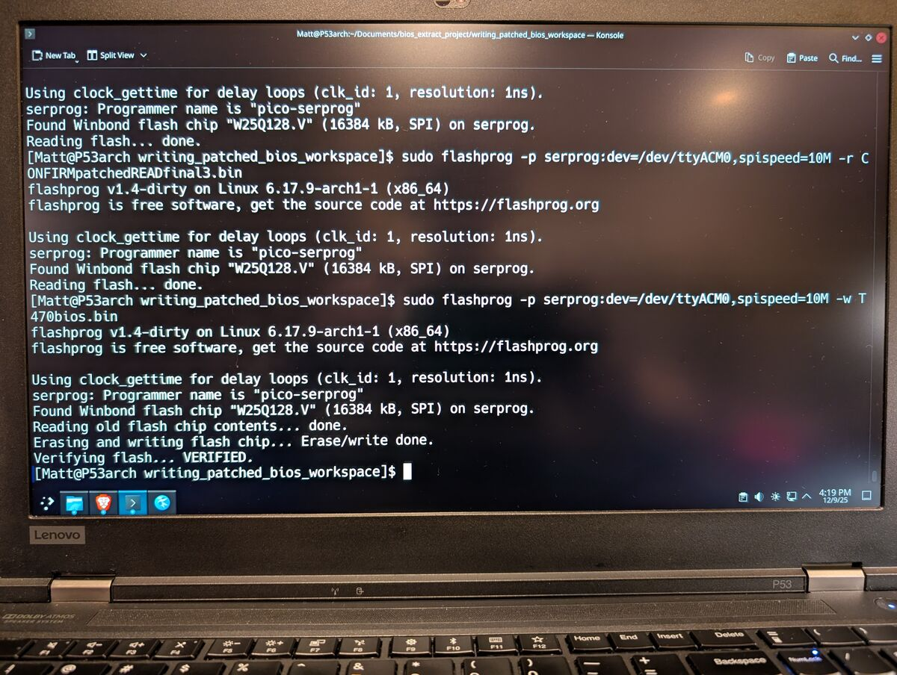

### <a id="94-verify-the-write"></a>9.4 Verify the Write

READ the chip one last time:
<br>
<small><i>bash:</i></small>

```bash
sudo flashprog -p serprog:dev=/dev/ttyACM0,spispeed=10M -r CONFIRM_T470_READfinal.bin
```

Make sure it matches the original BIOS we flashed.

### <a id="95-disconnect-programmertest-clip"></a>9.5 Disconnect Programmer/Test Clip

Disconnect the Pico2 from the host PC first (USB-A), then disconnect the test clip from the chip.

---

## <a id="10-confirmation-and-reassembly"></a>10. Confirmation and Reassembly

Now we just need to verify that it worked and reassemble the laptop:

### <a id="101-verify-svp-removal"></a>10.1 Verify SVP Removal

- Again, reassemble the laptop enough to where you can use the keyboard/display, and safely power it on.
- Plug in the power adapter and power on the laptop.
- Powering on may require multiple attempts and it may shut off/restart on its own. Eventually it should stabilize and show the red Lenovo splash screen and act normal.
- When entering BIOS settings, it should no longer require a password.
- Under the Security tab, "Supervisor Password" should also now be set to Disabled.

### <a id="102-reset-bios-settings-to-factory-defaults"></a>10.2 Reset BIOS Settings to Factory Defaults

- Navigate to the "Restart Tab" in ThinkPad Setup
- Select "Load Setup Defaults"
- Save Changes and Exit
- Power off laptop
- Disconnect the power adapter and hold power button for 30 seconds

### <a id="103-reassemble-laptop"></a>10.3 Reassemble Laptop

Reinstall the internal battery, SSD/HDD, CMOS battery and anything you previously disconnected/removed, including all covers and screws.

---
---

## <a id="appendix-1-compatible-laptops"></a>Appendix 1: Compatible Laptops

ThinkPads between 2012-2018, 4th to 8th gen Intel, see compatible models list below. The ThinkPad with the supervisor password will be referred to as the target in this guide. Also do some research on your specific ThinkPad's model and make sure its BIOS is stored on an SOIC-8 (package type) chip. Some ThinkPads use a WSON-8, which will require a different "test clip" (actually a WSON-8 Probe Line/Pogo Pin Adapter) for in-circuit programming and is substantially more difficult. Instead of clipping to the chip, you would have to manually hold the adapter to the chip in the precise position during programming, create a fixture to hold it, or you would have to desolder the chip and place it into a dedicated ZIF (Zero Insertion Force) or clamshell socket for programming. For this route, it is popular to remove the WSON-8 chip, read the BIOS/firmware, then replace the WSON-8 chip with a compatible SOIC-8 chip on the motherboard, and then use a test clip for programming.

ALLEGED KNOWN WORKING COMPATIBLE LENOVO THINKPAD MODELS
From post: [https://www.badcaps.net/forum/troubleshooting-hardware-devices-and-electronics-theory/troubleshooting-laptops-tablets-and-mobile-devices/bios-requests-only/78215-lenovo-bios-auto-patcher-for-supervisor-password-removal?p=1809652#post1809652](https://www.badcaps.net/forum/troubleshooting-hardware-devices-and-electronics-theory/troubleshooting-laptops-tablets-and-mobile-devices/bios-requests-only/78215-lenovo-bios-auto-patcher-for-supervisor-password-removal?p=1809652#post1809652)

By: AAAC

This is the list I use, seems like it contains most of the models compatible with the DXE driver patch solution, if it's not in the list, most likely the DXE driver patch won't work, specially if BIOS is 32MB:

```text
ThinkPad 13 (20GJ, 20GK, 20J1, 20J2)
ThinkPad 25 (20K7)
ThinkPad A485 (20MU, 20MV)
ThinkPad Helix Gen 3

ThinkPad E14 (20RA, 20RB)
ThinkPad E470 (20H1, 20H2)
ThinkPad E480 (20KN, 20KQ)
ThinkPad E485 (20KU)
ThinkPad E490 (20N8, 20N9)
ThinkPad E495 (20NE)
ThinkPad E490s (20NG)
ThinkPad E570 (20H5, 20H6)
ThinkPad E580 (20KS, 20KT)
ThinkPad E585 (20KV)
ThinkPad E590 (20NB, 20NC)
ThinkPad E595 (20NF)

ThinkPad L380 (20M5, 20M6)
ThinkPad L380 Yoga (20M7, 20M8)
ThinkPad L390 (20NR, 20NS) [32MB]
ThinkPad L390 Yoga (20NT, 20NU) [32MB]
ThinkPad L440 (20AS, 20AT)
ThinkPad L450 (20DS, 20DT)
ThinkPad L460 (20FU, 20FV)
ThinkPad L470 (20JU, 20JV)
ThinkPad L540 (20AU, 20AV)
ThinkPad L560 (20F1, 20F2)
ThinkPad L570 (20J8, 20J9, 20JQ, 20JR)

ThinkPad P40 Yoga (20GQ, 20GR)
ThinkPad P50 (20EN, 20EQ)
ThinkPad P50s (20FK, 20FL)
ThinkPad P51 (20HH, 20HJ)
ThinkPad P51s (20HB, 20HC, 20JY, 20K0)
ThinkPad P52 (20M9, 20MA) [32MB]
ThinkPad P52s (20LB, 20LC)
ThinkPad P70 (20ER, 20ES)
ThinkPad P72 (20MB, 20MC) [32MB]

ThinkPad T440 (20B6, 20B7)
ThinkPad T440p (20AN, 20AW)
ThinkPad T440s (20AQ, 20AR)
ThinkPad T450 (20BU, 20BV, 20DJ)
ThinkPad T450s (20BW, 20BX)
ThinkPad T460 (20FM, 20FN)
ThinkPad T460p (20FW, 20FX)
ThinkPad T460s (20F9, 20FA)
ThinkPad T470 (20HD, 20HE, 20JM, 20JN)
ThinkPad T470p (20J6, 20J7)
ThinkPad T470s (20HF, 20HG, 20JS, 20JT)
ThinkPad T480 (20L5, 20L6)
ThinkPad T480s (20L7, 20L8)
ThinkPad T495 (20NJ, 20NK)

ThinkPad T540p (20BE, 20BF)
ThinkPad T550 (20CJ, 20CK)
ThinkPad T560 (20FH, 20FJ)
ThinkPad T570 (20H9, 20HA, 20JW, 20JX)
ThinkPad T580 (20L9, 20LA)

ThinkPad W540 (20BG, 20BH)
ThinkPad W541 (20EF, 20EG)
ThinkPad W550s (20E1, 20E2)

ThinkPad X1 Carbon Gen 2 (20A7, 20A8)
ThinkPad X1 Carbon Gen 3 (20BS, 20BT)
ThinkPad X1 Carbon Gen 4 (20FB, 20FC)
ThinkPad X1 Carbon Gen 5 (20HQ, 20HR, 20K3, 20K4)
ThinkPad X1 Carbon Gen 6 (20KH, 20KG)

ThinkPad X1 Tablet 3rd Gen (20KJ, 20KK)*

ThinkPad X1 Yoga Gen 1 (20FQ, 20FR)
ThinkPad X1 Yoga Gen 2 (20JD, 20JE, 20JF, 20JG)
ThinkPad X1 Yoga Gen 3 (20LD, 20LE, 20LF, 20LG)

ThinkPad X240 (20AL, 20AM)
ThinkPad X240s (20AJ, 20AK)
ThinkPad X250 (20CL, 20CM)
ThinkPad X260 (20F5, 20F6)
ThinkPad X270 (20HM, 20HN, 20K5, 20K6)
ThinkPad X280 (20KE, 20KF)

ThinkPad Yoga 14 (20FY)
ThinkPad Yoga 260 (20FD, 20FE, 20GS, 20GT)
ThinkPad Yoga 370 (20JH, 20JJ, 20JK, 20JL)
ThinkPad Yoga 460 (20EL, 20EM)
ThinkPad Yoga X380 (20LH, 20LJ)
```

---

## <a id="appendix-2-note-on-linux"></a>Appendix 2: Note on Linux

We will refer to the Linux computer as the host PC. The process can be done with Windows using Windows Subsystem for Linux (WSL), or other native, specific applications for Windows (like ASprogrammer) but the specifics will be different. If you are using a distribution other than an Arch-based one, package manager commands will be different, but everything else should be the same.

---

## <a id="appendix-3-standard-uefi-platform-initialization-pi-flow"></a>Appendix 3: Standard UEFI Platform Initialization (PI) Flow

Essentially, this is the technical blueprint for the entire boot process:

<b>---OVERVIEW---</b>

1. SEC (Security): Initial CPU and system initialization.
2. PEI (Pre-EFI Initialization): Initializes system memory and core hardware.
3. DXE (Driver Execution Environment): Loads most hardware drivers.
4. BDS (Boot Device Selection): Selects and boots the intended device or OS.
5. TSL (Transient System Load): The OS loader executes and prepares to hand over control.
6. RT (Runtime): The OS is running; only UEFI Runtime Services remain active.
7. AL (After Life): The OS shuts down/resets and firmware handles final cleanup.

<br>

<b>---DETAILS---</b>

<b>1. SEC (Security) Phase</b>
<br>
The main purpose of the SEC phase is to establish the system’s initial Root of Trust and a minimal, secure environment for the transition to the Pre-EFI Initialization (PEI) phase. This process begins at the x86 reset vector (0xFFFFFFF0), the first instruction the CPU fetches immediately following a power-on or hardware reset.

<div style="margin-left: 2em;">
<b>1.1 Handling Platform Restart Events</b>
<div style="margin-left: 2em;">
It manages all system start and restart events, including cold boots (powering on from an unpowered state), warm resets, and various exception conditions.
</div>

<br>
<b>1.2 Initializing the Processor & Creating Temporary Memory</b>
<div style="margin-left: 2em;">
This is known as the pre-memory stage. It handles basic processor initialization such as switching to protected mode and loading necessary microcode. Since main system RAM is not yet initialized, the SEC phase configures the CPU's internal cache to act as temporary memory or Cache-as-RAM (CAR).
</div>

<br>
<b>1.3 Serving as the Root of Trust</b>
<div style="margin-left: 2em;">
It acts as the system's foundational trust anchor. It is responsible for verifying the integrity and authenticity of the next piece of code, typically the PEI Foundation, before handing over control.
</div>

<br>
<b>1.4 Passing Handoff Information to PEI</b>
<div style="margin-left: 2em;">
Its final responsibility is to pass critical state information to the PEI Foundation entry point. This data includes:
<br>

- The overall state of the platform.
- The location and size of the Boot Firmware Volume (BFV).
- The location and size of the temporary RAM and the stack.

</div>

(source: [https://uefi.org/specs/PI/1.8/V1_Security_SEC_Phase_Information.html](https://uefi.org/specs/PI/1.8/V1_Security_SEC_Phase_Information.html))

</div>
<br>
<b>2. PEI (Pre-EFI Initialization) Phase</b>
<br>
The main purpose of the PEI phase is to initialize permanent memory (RAM), discover hardware, and pass control to the DXE phase.

<div style="margin-left: 2em;">
<br>
<b>2.1 Dispatch PEIMs</b>
<div style="margin-left: 2em;">
The PEI Foundation uses a dependency-aware dispatcher to load and run specialized drivers called Pre-EFI Initialization Modules (PEIMs). These modules initialize critical hardware (such as the CPU and chipset) once their specific requirements (dependencies) are met.
</div>

<br>
<b>2.2 Initialize Permanent Memory</b>
<div style="margin-left: 2em;">
Since the system starts with only the CPU cache as temporary memory (Cache-as-RAM), the PEI phase uses the Memory Reference Code (MRC, a specialized PEIM) to initialize the memory controller and DRAM. This establishes the permanent system memory required to launch the DXE phase.
</div>

<br>
<b>2.3 Determine Boot Mode</b>
<div style="margin-left: 2em;">
It identifies the reason for the restart, such as a normal boot, an S3 sleep resume, or a crisis recovery event, and decides which initialization paths to take.
</div>

<br>
<b>2.4 Create Hand-Off Blocks (HOBs)</b>
<div style="margin-left: 2em;">
Since PEI is "memory-poor," it summarizes the system state and memory allocation into data structures called Hand-Off Blocks (HOBs), which are passed to the DXE Initial Program Load (IPL) PPI, (which then passes it to the DXE Foundation) in the next phase to inform it of the hardware status.
</div>

(source: [https://uefi.org/specs/PI/1.8/V1_Overview.html](https://uefi.org/specs/PI/1.8/V1_Overview.html))

</div>
<br>
<b>3. DXE (Driver Execution Environment) Phase</b>
<br>
This is where the majority of system initialization occurs. Having established permanent memory, the system transitions from a minimal, temporary state into a robust 64-bit environment. In this phase, the firmware loads and executes complex drivers for hardware such as storage controllers, network adapters, and input devices, creating a fully functional UEFI interface.

<div style="margin-left: 2em;">
<br>
<b>3.1 Launch DXE Foundation</b>
<div style="margin-left: 2em;">
The DXE Foundation is initialized using the Hand-Off Blocks (HOBs) received from the PEI phase. It acts as the system’s core by producing the UEFI System Table and establishing Boot Services (such as memory allocation) and Runtime Services, which provide the standardized interfaces that will eventually be available to the operating system.
</div>

<br>
<b>3.2 Dispatch DXE Drivers</b>
<div style="margin-left: 2em;">
The DXE Dispatcher discovers and executes DXE drivers stored in firmware volumes. These drivers are loaded in a specific order based on their dependency requirements to initialize complex hardware such as the chipset, PCI enumeration, and storage controllers (like the NVMe drive) while providing the protocols needed for boot devices.
</div>

<br>
<b>3.3 Produce UEFI Protocols</b>
<div style="margin-left: 2em;">
DXE drivers produce Architectural Protocols that translate complex hardware (like the CPU, Security, and Timers) into standardized interfaces. These protocols allow the DXE Foundation and future phases to interact with the system without needing platform-specific code, creating the environment required for the UEFI Shell or Boot Manager.
</div>

<br>
<b>3.4 Initialize Management Mode (MM)</b>
<div style="margin-left: 2em;">
During this stage, the System Management Mode (SMM) infrastructure is established and locked. This provides a secure, isolated execution environment for critical low-level tasks like power management and security monitoring.
</div>

<br>
<b>3.5 Hand-Off to BDS</b>
<div style="margin-left: 2em;">
Once all necessary drivers are loaded and the hardware is fully initialized, the DXE phase concludes by passing control to the Boot Device Selection (BDS) phase, which is responsible for showing the Lenovo splash screen and launching the operating system.
</div>

(source: [https://uefi.org/specs/PI/1.8/V2_Overview.html](https://uefi.org/specs/PI/1.8/V2_Overview.html))

</div>
<br>
<b>4. BDS (Boot Device Selection) Phase</b>
<br>
The role of the BDS is to bridge the gap between the fully initialized UEFI environment and the loading of the operating system. During this phase, the system implements the platform's specific boot policy to locate and launch an OS loader or a transient application (such as the UEFI Shell).

<div style="margin-left: 2em;">
<br>
<b>4.1 Initialize Console Devices</b>
<div style="margin-left: 2em;">
The BDS phase identifies and initializes primary input/output devices (like the keyboard and screen) based on NVRAM variables. It also loads any remaining device drivers specified in the DriverOrder variables that were skipped during DXE.
</div>

<br>
<b>4.2 Evaluate Boot Policies</b>
<div style="margin-left: 2em;">
The system interprets the platform's boot configuration data to prioritize devices. It follows the defined boot order, checking for an OS loader on the HDD/SSD first, followed by USB or a Network (PXE) options.
</div>

<br>
<b>4.3 Launch Boot Option</b>
<div style="margin-left: 2em;">
The BDS manager identifies bootable partitions and attempts to load the OS Loader (such as bootmgfw.efi). Once the loader is successfully started, the BDS phase concludes (this is where the system transitions from the Lenovo splash screen to launching the Windows or Linux boot manager).
</div>

(source: [https://uefi.org/specs/PI/1.8/V2_Boot_Manager.html](https://uefi.org/specs/PI/1.8/V2_Boot_Manager.html))

</div>
<br>
<b>5. TSL (Transient System Load) Phase</b>
<br>
This phase acts as the "handover" environment and final bridge between the firmware and the operating system. During TSL, the OS loader runs while firmware boot services are still available, allowing the loader to prepare the kernel for execution and officially terminate boot services to hand full hardware control to the OS.

<div style="margin-left: 2em;">
<br>
<b>5.1 Execution of the Boot Loader</b>
<div style="margin-left: 2em;">
The OS loader (Windows Boot Manager or GRUB) takes control. It uses UEFI Boot Services to perform final hardware discovery, read the OS kernel from the disk, and load it into memory.
</div>

<br>
<b>5.2 Finalize Runtime Services</b>
<div style="margin-left: 2em;">
While the loader prepares the kernel, Runtime Services (established in DXE) are finalized. These stay resident in memory to remain accessible to the operating system even after the firmware exits.
</div>

<br>
<b>5.3 Exit Boot Services</b>
<div style="margin-left: 2em;">
The loader calls ExitBootServices(). This is the "point of no return" where the firmware terminates its control, reclaims boot-time memory, and officially hands full hardware control to the OS kernel, transitioning the system to the Runtime (RT) phase.
</div>

(source: [https://github.com/tianocore/tianocore.github.io/wiki/PI-Boot-Flow](https://github.com/tianocore/tianocore.github.io/wiki/PI-Boot-Flow))

</div>
<br>
<b>6. RT (Runtime) Phase</b>
<br>
The RT phase is the ongoing stage where the OS has main control but still relies on firmware for essential low-level tasks.

<div style="margin-left: 2em;">
<br>
<b>6.1 Transfer Control</b>
<div style="margin-left: 2em;">
The system enters the Runtime Phase as the OS kernel starts. The firmware is no longer in charge, but it stays "resident" in a small, protected area of memory to provide specific Runtime Services (like updating UEFI variables or accessing the Real-Time Clock).
</div>

<br>
<b>6.2 OS Sovereignty</b>
<div style="margin-left: 2em;">
The OS is now fully operational and manages its own drivers. This is the point where the Windows or Linux login screen appears. The firmware only intervenes if a System Management Interrupt (SMI) occurs or for a firmware-level security task.
</div>

(source: [https://uefi.org/specs/UEFI/2.10_A/02_Overview.html](https://uefi.org/specs/UEFI/2.10_A/02_Overview.html))

</div>
<br>
<b>7. AL (After Life) Phase</b>
<br>
The After Life (AL) Phase is the final stage of the UEFI boot flow. It only occurs when the operating system shuts down, restarts, sleeps, hibernates, or encounters a catastrophic failure.

<div style="margin-left: 2em;">
<br>
<b>7.1 Initiation of State Change</b>
<div style="margin-left: 2em;">
The phase begins when the OS signals a power state change (like Shutdown S5 or Reset). This is typically triggered by the OS invoking the UEFI ResetSystem() Runtime Service, transitioning the system from the OS Runtime environment back into a firmware-controlled state.
</div>

<br>
<b>7.2 State Preservation & Variable Handling</b>
<div style="margin-left: 2em;">
While Boot Services are long gone, Runtime Services remain active. The firmware uses this time to save critical system variables and configuration data to Non-Volatile RAM (NVRAM). This ensures that any "last-minute" settings changes made during the OS session are persisted before power is lost.
</div>

<br>
<b>7.3 Diagnostic Logging & Recovery</b>
<div style="margin-left: 2em;">
If the transition to AL is caused by a system crash or firmware-detected failure, this step captures diagnostic data. On hardware like a ThinkPad T470, the firmware may write error logs to the NVRAM. This allows for "post-mortem" analysis via BIOS diagnostics once the system is powered back on.
</div>

<br>
<b>7.4 Firmware Update Execution (Capsule Updates)</b>
<div style="margin-left: 2em;">
If a BIOS/UEFI update was staged while the OS was running (known as a UEFI Capsule Update), the AL phase is the window where the firmware actually "flashes" the update. This happens in a semi-protected state before the final reboot to ensure the update process isn't interrupted by the OS.
</div>

<br>
<b>7.5 Security Sanitization & Root of Trust</b>
<div style="margin-left: 2em;">
To maintain the Root of Trust, the AL phase may clear sensitive data from volatile memory or lock specific hardware registers. This ensures that "secrets" from the previous session aren't accessible across a warm reboot or to a malicious actor during power-on.
</div>

<br>
<b>7.6 Final Hardware Reset</b>
<div style="margin-left: 2em;">
The phase concludes with an orderly software-to-hardware handoff. The firmware pulls the Reset line on the CPU or cycles the power. This terminates the After Life phase and immediately triggers the Security (SEC) phase, restarting the entire UEFI boot cycle from scratch.
</div>

(source: [https://tianocore-docs.github.io/edk2-BuildSpecification/release-1.28/2_design_discussion/23_boot_sequence.html](https://tianocore-docs.github.io/edk2-BuildSpecification/release-1.28/2_design_discussion/23_boot_sequence.html))
</div>

---

## <a id="appendix-4-the-embedded-controller-ec"></a>Appendix 4: The Embedded Controller (EC)

On my T470, the Embedded Controller, a Microchip MEC1653, is a specialized microprocessor which manages essential hardware-level functions that operate independently of the main CPU and Operating System. The EC utilizes an internal EEPROM to maintain a dedicated NVRAM partition, which is where the supervisor password hash is securely stored as a system variable.

The MEC1653 uses a BGA (Ball Grid Array) package, specifically a 169-pin LFBGA. Unlike the 8-pin SOIC-8 (Small Outline Integrated Circuit) chips commonly used for the system BIOS or Thunderbolt firmware, this chip has a dense grid of solder balls on its underside. It is physically larger and more complex to replace or flash manually, typically requiring professional tools like an SVOD3 programmer and connection via a JTAG port. Also, attempting to desolder a BGA chip to read it requires advanced hot-air rework skills (ideally a professional BGA rework station) and carries a high risk of permanently damaging the motherboard.

Even if you could access the data on the EC, only the hash of the SVP is stored and simply erasing it would almost certainly trigger a data verification error. Because of this, injecting a modified DXE driver (i.e tricking the EC into clearing it itself) is easier and safer than directly modifying EC data.

---

## <a id="appendix-5-normal-svp-verification-process"></a>Appendix 5: Normal SVP Verification Process

This is an overview of how the SVP is verified under normal operating circumstances:

-After the laptop is powered on, relatively early in the boot process (immediately after RAM initializes) DXE drivers and SMM modules load. Some of the relevant ones are:

- LenovoSvpManagerDxe
- LenovoSvpManagerSmm (this is an SMM module)
- LenovoCryptService
- LenovoCryptServiceSmm (this is an SMM module)
- EmulatedEepromSmm (this is an EC SMM module)*
- EmulatedEepromDxe (this is an EC DXE driver)*

<div style="margin-left: 2em;">
* The name "EmulatedEeprom" in EmulatedEepromSmm and EmulatedEepromDxe refers to the way the firmware treats the EC's storage. To the rest of the UEFI BIOS, the driver makes the EC's internal memory look like a standard, addressable EEPROM, even though it is actually a specialized hardware interface managed by the EC's own firmware

</div>
<br>

-LenovoSvpManagerSMM immediately checks with the EC for the presence of the Supervisor Password hash during its own initialization phase within the DXE stage. This happens before anything even displays on the screen

-LenovoSvpManagerDxe asks LenovoSvpManagerSMM the status of the SVP and prepares the GUI logic based on that status

-If a password hash exists, LenovoSvpManagerSmm requests the "true" hash from the EC

-EmulatedEepromSmm returns the "true" hash from the EC internal EEPROM and hands it to LenovoSvpManagerSmm, which stores it in a protected buffer within System Management Mode RAM (SMRAM)

<div style="margin-left: 2em;">

-If you just let the computer boot normally (i.e don't try to access BIOS/setup menu), LenovoSvpManagerDxe stays "quiet" in the background and lets you pass

</div>

-If you press F1 or Enter to access the ThinkPad Setup program, the BIOS sends a signal that "intercepts" the boot process and hands control over to the security driver, LenovoSvpManagerDxe. If an SVP is set, LenovoSvpManagerDxe draws the password prompt window GUI (the little lock or "Enter Password" icon) onto the screen. It then sits in an infinite loop, waiting for input from the keyboard

-LenovoSvpManagerDxe captures plaintext input from the keyboard (user types in a password)

-LenovoSvpManagerDxe requests LenovoCryptService (possibly LenovoCryptServiceSmm) to calculate the hash of that input (likely a salted SHA-256)

-LenovoSvpManagerSmm performs the hash comparison:

<div style="margin-left: 2em;">

-<b>MATCH:</b> LenovoSvpManagerSmm sets a secure variable in the SMM-protected range of memory, allowing access to BIOS/UEFI menu

-<b>NO MATCH:</b> The GUI prompt typically clears the entry and displays a small "X" or a generic "Password Invalid" message

<div style="margin-left: 2em;">

-If you press Enter without a password or enter an incorrect one, the system may still allow you into the ThinkPad Setup program, but almost all critical settings (like boot order, security, and hardware config) will be grayed out and unmodifiable

-LenovoSvpManagerSMM is responsible for managing the retry logic. It increments a failure counter stored in the Embedded Controller (EC). By default, after three incorrect attempts, the system will stop accepting input and often require a reboot before you can try again

-If the maximum retry count is exceeded across multiple boot sessions, the firmware triggers POST Error 0199: Security password retry count exceeded

</div>
</div>

(source for this process summary: [https://www.synacktiv.com/en/publications/a-journey-in-reversing-uefi-lenovo-passwords-management](https://www.synacktiv.com/en/publications/a-journey-in-reversing-uefi-lenovo-passwords-management))

<br>
Using UEFITool, I can verify the existence of each of these DXE drivers/SMM modules within my T470 BIOS:

- LenovoCryptService
- LenovoCryptServiceSmm
- LenovoSvpManagerDxe
- LenovoSvpManagerSmm

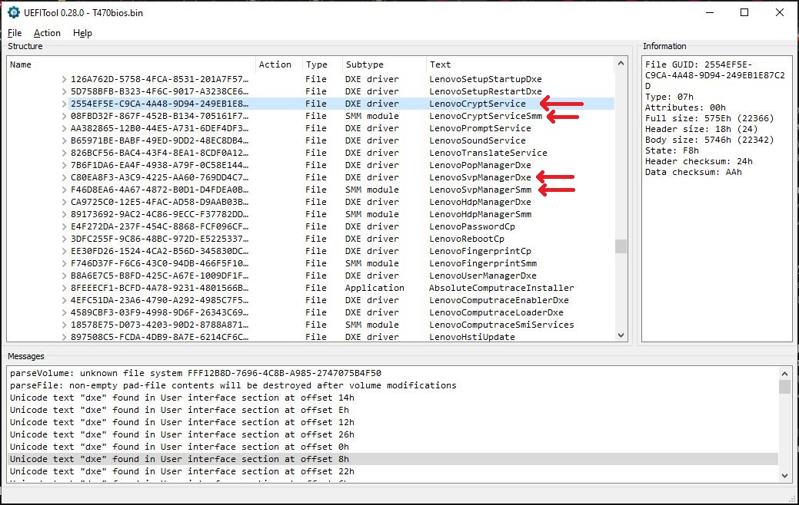

<br>

The EC memory driver modules:

- EmulatedEepromDxe
- EmulatedEepromSmm

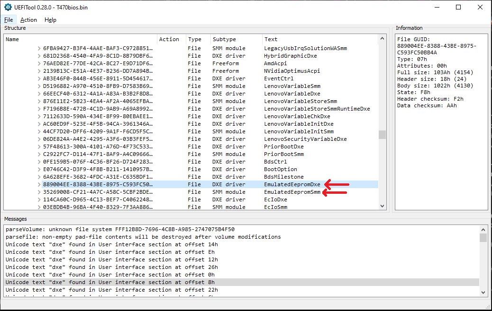

<br>
<b>Recap on SMM Modules (System Management Mode)</b>

- SMM is often called "Ring -2" because it is more privileged than the OS (Ring 0) and even the Hypervisor/Virtualization (Ring -1). When a "System Management Interrupt" (SMI) occurs, the entire CPU pauses what it is doing and jumps into SMM to run these modules
- SMM is deeply tied to protected memory, specifically a region called SMRAM
- SMM modules are loaded into SMRAM, which the CPU hardware locks during the boot process
- Once locked, this memory is invisible and inaccessible to the Operating System or any malware running in Windows. Only the CPU itself can see this memory when it is specifically in SMM mode
- In general, only SMM modules can access SMRAM

For another in-depth analysis on exactly how this works and even more details, Mark Juvan at Radboud University Nijmegen in 2024 did his Master of Science (MSc) thesis report on this very topic. It is publicly available online at [https://www.cs.ru.nl/masters-theses/2024/M_Juvan___Bypassing_the_BIOS_supervisor_password.pdf](https://www.cs.ru.nl/masters-theses/2024/M_Juvan___Bypassing_the_BIOS_supervisor_password.pdf) which actually references many of the same exact sources/posts I found my info from.

---

## <a id="appendix-6-how-modified-dxe-driver-exploit-works"></a>Appendix 6: How Modified DXE Driver Exploit Works

DXE Driver Injection: The autopatcher injects modified DXE drivers into the BIOS image. When you boot this patched BIOS, these drivers load early in the boot sequence and signal the Embedded Controller to "wipe" or reset the password hash stored in its internal EEPROM.

NVRAM Cleanup (Newer Generations): For "newer" generations like the T470, simply clearing the hash in the EC isn't enough. The BIOS itself also stores status flags in the NVRAM variables on the SPI chip. If these variables aren't "cleaned" (reset to defaults), the system may still think a password is set or trigger a security "tamper" state.

---

## <a id="appendix-7-why-this-doesnt-work-for-newer-laptops"></a>Appendix 7: Why This Doesn't Work for Newer Laptops

For newer 9th-generation models and beyond, this modified DXE driver method doesn't work due to improvements in both digital signature verification (i.e the DXE drivers signature being checked by the CPU) as well as Intel Boot Guard (which prevents a modified BIOS from booting).

In newer models, the SVP hash has been moved to more advanced Embedded Controllers, such as the MEC1663 where the communication between the BIOS and these new controllers is often encrypted or restricted. Even if you could bypass Boot Guard to run a custom driver, that driver would lack the necessary permissions to command the newer EC to erase its internal password storage.

---

## <a id="appendix-8-history-of-dxe-driver-exploit"></a>Appendix 8: History of DXE Driver Exploit

This exploit was discovered by Romanian developer and security researcher Victor Voinea around late 2018 or early 2019 (according to various forums on badcaps.net and ALLservice.ro). Victor Voinea is the same guy who founded ALLservice.ro and makes IBMpass (a proprietary tool for decoding the SVP from IBM-era ThinkPads).

He typically provided his exploits as proprietary, paid services. He would often require users to send him a dump of their BIOS, which he would then patch and return for a fee.

His discovery of the DXE injection method was eventually reverse-engineered by members of the community on forums like badcaps.net. This led to the creation of the free, automated "Auto Patcher" by Knucklegrumble.

---

## <a id="appendix-9-role-of-the-injected-drivers"></a>Appendix 9: Role of the Injected Drivers

Here is relevant output again from the autopatch script:

```text
Using UEFIReplace to inject 2 DXE drivers...
[1/2] LenovoTranslateService (GUID 826bcf56-bac4-43f4-8ea1-8cdf0a121abd)
[2/2] BootOption (GUID e0746c42-d3f9-4f8b-b211-1410957b9ff5)

Looking for volumes to patch...
[1/1] NVRAM_EfiSystemNvDataFvGuid (checksum 2609h):
      Found volume at offset 800000h (checksum 2609h)
      Replacing volume.

Done.
```

Analyzing my original BIOS using UEFITool (both the regular and the New Engine (NE) versions), both of these replaced DXE drivers and the patched volume can be located:

<b>DXE drivers:</b>

- LenovoTranslateService
  - GUID 826bcf56-bac4-43f4-8ea1-8cdf0a121abd
- BootOption
  - GUID e0746c42-d3f9-4f8b-b211-1410957b9ff5

Both of these can be seen in UEFITool as well as their GUIDs:
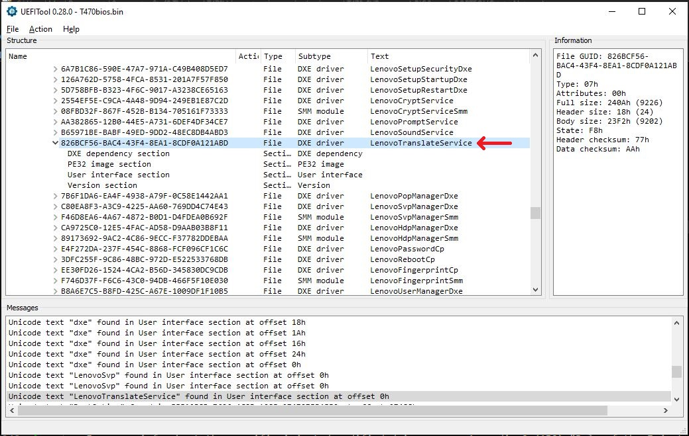

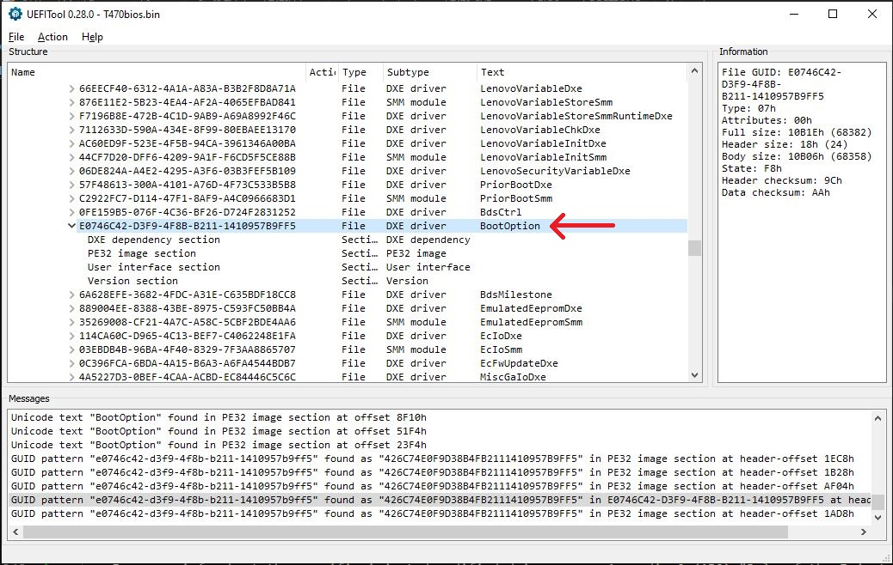

<br>
<b>Volume (EfiSystemNvDataFvGuid):</b>
<br>
IN AUTOPATCH OUTPUT:

- Found volume at offset 800000h
- (checksum 2609h)

<br>
IN UEFITool_NE:

- Subtype: NVRAM
- Base: 800000h
- Checksum: 0926h, valid

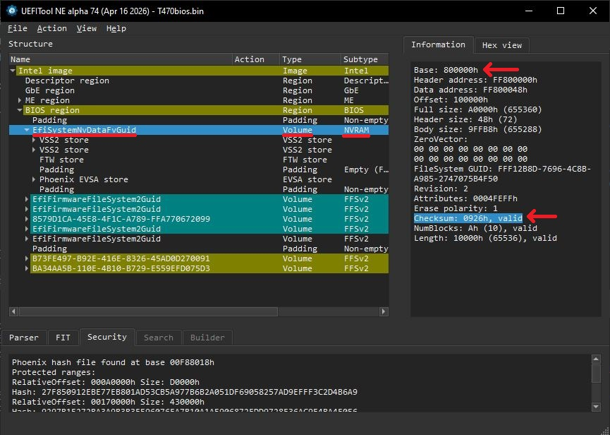

"Found volume at offset 800000h" (from the autopatch output) and "Base: 800000h" (in UEFITool_NE) are two ways of describing the same location in the BIOS file.

The difference in the checksum (2609h in the script output vs 0926h in UEFITool_NE) is due to Endianness, specifically how multi-byte numbers are stored in memory versus how they are displayed by software.

---

## <a id="appendix-10-problems-and-notes-1"></a>Appendix 10: Problems and Notes 1

Initially, I tried using the following suggested command from Riku_V's webpage [(Riku_V, Source 3)](#source3) (**note the spispeed**):

<small><i>bash:</i></small>

```bash
flashprog -p serprog:dev=/dev/ttyACM0,spispeed=32M -r flash.bin
```

I got this error:

```text
flashprog v1.4-dirty on Linux 6.17.9-arch1-1 (x86_64)
flashprog is free software, get the source code at https://flashprog.org

Using clock_gettime for delay loops (clk_id: 1, resolution: 1ns).
serprog: Programmer name is "pico-serprog"
Found Generic flash chip "unknown SPI chip (RDID)" (0 kB, SPI) on serprog.
===
This flash part has status NOT WORKING for operations: PROBE READ ERASE WRITE
The test status of this chip may have been updated in the latest development
version of flashprog. If you are running the latest development version,
please email a report to flashprog@flashprog.org if any of the above
operations work correctly for you with this flash chip. Please include the
flashprog log file for all operations you tested (see the man page for details),
and mention which mainboard or programmer you tested in the subject line.
Thanks for your help!
Read is not working on this chip. Aborting.
```

At first, I thought it might be because I was using a Pico2 and not a 1st gen Pico. I had read on libreboot.org [(Libreboot, Source 5)](#source5) (as well as elsewhere) that there are known compatibility issues with the Pico2. So I got out my 1st gen Pico, and also decided to try Stacksmashing's version of serprog [(Stacksmashing, Source 4)](#source4) (the upstream repository of Riku_V's fork). Stacksmashing's version uses a different pinout than Riku_V's so I rewired everything and reattached the clip.

I got the same error as before. At this point, I was leaning towards something else being the issue. After some more research on badcaps.net and github.com, I saw suggestions to try a slower SPI speed (the original command I was trying used 32M).

So I changed this to 800k and ran the command again. This time it worked and after about 5 minutes I got an output file. I tried another SPI speed (10M) and it also worked, and took about 20 seconds.

I ran each command a few more times, knowing I would need to compare them and make sure they all matched exactly (using a binary comparison) to ensure nothing was corrupted during the reading. Unfortunately, none of them matched each other. At this point, since there was no consistency to the corruption amongst the dumps, I thought it was likely a bad connection (there is substantial room for error: the Pico2 (which has soldered headers, probably not the problem) is plugged into a breakout board, jumper wires are connected from the breakout board to the test clip, and the test clip is clipped onto the flash chip).

I disconnected the test clip, all the jumper wires, and cleaned the BIOS chip pins with some 90% isopropyl alcohol on a q-tip.

Unsure what to do next, just out of sheer curiosity, knowing that the SPI speed was likely the reason the chip wasn't even recognized the first time, I got out the Pico2 again and freshly downloaded and recompiled Riku_V's pico-serprog firmware for it (just in case):

<small><i>bash:</i></small>

```bash
git clone https://codeberg.org/Riku_V/pico-serprog.git .
cmake . -DPICO_BOARD=pico2
make
```

<br>
I then reflashed it to the Pico2, rewired up the breakout board/test clip for this version of pico-serprog, and hooked it back up to the chip. I ran:

<small><i>bash:</i></small>

```bash
sudo flashprog -p serprog:dev=/dev/ttyACM0,spispeed=10M -r flash.bin
```

and it again finished in about 20 seconds.

I ran this command several more times, changing the output file name to save the additional dumps. Then I changed the SPI speed from 10M to 500k and ran it another couple of times. This time it took around 5-6 minutes.

I did binary comparisons and checked the MD5 checksums and every one of them matched, both 10MHz and 500kHz SPI speed dumps.

In the process of hooking everything back up and cleaning the BIOS chip with isopropyl, I must have solved my intermittent connectivity issue which led to my inconsistent reads in my first attempt.

The datasheet for the BIOS flash chip says it supports up to 104MHz. Here is my theory: first, I had a dirty/bad connection. Second, the reason I was unable to get the 32MHz SPI speed to work is likely due to the physical hardware setup (like the Pico2's "12-Mbps" Micro-USB connection) and signal integrity issues. If everything was soldered (i.e no DuPont connections on jumper wires, very short wires, etc) I probably could have gotten higher speeds to work. Additionally, regarding using a Pico2 as a serial programmer, libreboot.org [(Libreboot, Source 5)](#source5) says:
<br>
<i>"spispeed=32M usually works, but since it’s not much faster it’s probably not worth it. The 12Mbps USB port is limiting the actual speed here."</i>

---

## <a id="appendix-11-problems-and-notes-2"></a>Appendix 11: Problems and Notes 2

During my first attempt, I did not add execute permissions for UEFIReplace (7.5) before running the script. It DID generate an output file (bios_PATCHED.bin) and the following error:

```text
PermissionError: [Errno 13] Permission denied: '/home/Matt/Documents/bios_extract_project/ztest/patch/../tools/UEFIReplace'
```

Also, the output file was identical (checksum and binary comparison) to the original unpatched file, which means it just copied the input file as the output file and did not change anything.

The script uses UEFIReplace (which is a program, included from the .zip for the autopatcher, located in ./tools) and thus also needs execute permission. After adding execute permission to UEFIReplace, I ran the autopatch and got the output:

<small><i>output:</i></small>

```text
Using UEFIReplace to inject 2 DXE drivers...
[1/2] LenovoTranslateService (GUID 826bcf56-bac4-43f4-8ea1-8cdf0a121abd)
[2/2] BootOption (GUID e0746c42-d3f9-4f8b-b211-1410957b9ff5)

Looking for volumes to patch...
[1/1] NVRAM_EfiSystemNvDataFvGuid (checksum 2609h):
      Found volume at offset 800000h (checksum 2609h)
      Replacing volume.

Done.

PATCH FILE: bios_PATCHED.bin

Good luck.
```

No error message and this output means the autopatch was successful. Comparing checksums and doing a binary comparison, this patched file is indeed different from the original BIOS. I ran the autopatch script a few extra times (making sure not to overwrite the output file) to ensure it was generating the same patched BIOS every time, and it was.

---

<!-- omit in toc -->
## SOURCES CITED

<b id="source1">(Source 1)</b>
<br>
[https://www.badcaps.net/forum/troubleshooting-hardware-devices-and-electronics-theory/troubleshooting-laptops-tablets-and-mobile-devices/bios-requests-only/78215-lenovo-bios-auto-patcher-for-supervisor-password-removal?t=87588](https://www.badcaps.net/forum/troubleshooting-hardware-devices-and-electronics-theory/troubleshooting-laptops-tablets-and-mobile-devices/bios-requests-only/78215-lenovo-bios-auto-patcher-for-supervisor-password-removal?t=87588)
(Knucklegrumble, source1)

---

<b id="source2">(Source 2)</b>
<br>
[https://www.winbond.com/hq/support/documentation/levelOne.jsp?__locale=en&DocNo=DA00-W25Q128FV](https://www.winbond.com/hq/support/documentation/levelOne.jsp?__locale=en&DocNo=DA00-W25Q128FV)
(Winbond, source2)

---

<b id="source3">(Source 3)</b>
<br>
[https://codeberg.org/Riku_V/pico-serprog](https://codeberg.org/Riku_V/pico-serprog)
(Riku_V, source3)

---

<b id="source4">(Source 4)</b>
<br>
[https://github.com/stacksmashing/pico-serprog](https://github.com/stacksmashing/pico-serprog)
(Stacksmashing, source4)

---

<b id="source5">(Source 5)</b>
<br>
[https://libreboot.org/docs/install/spi.html#raspberry-pi-pico](https://libreboot.org/docs/install/spi.html#raspberry-pi-pico)
(Libreboot, source5)

---

<b id="source6">(Source 6)</b>
<br>
[https://www.badcaps.net/forum/troubleshooting-hardware-devices-and-electronics-theory/troubleshooting-laptops-tablets-and-mobile-devices/bios-requests-only/78215-lenovo-bios-auto-patcher-for-supervisor-password-removal?p=1448954#post1448954](https://www.badcaps.net/forum/troubleshooting-hardware-devices-and-electronics-theory/troubleshooting-laptops-tablets-and-mobile-devices/bios-requests-only/78215-lenovo-bios-auto-patcher-for-supervisor-password-removal?p=1448954#post1448954)

(post 14, from Knucklegrumble, the maker of the Autopatcher):
<br>
"The autopatcher has 2 steps. On the first pass it injects the patched DXE drivers. If the bios is from an older gen it ends there and its work is done. If it's a newer generation on the second pass it replaces parts of the NVRAM with clean ones and then it's done. I've patched some of the ones you have listed in NOK and they all reported working."
(Knucklegrumble, source6)

---

<b id="source7">(Source 7)</b>
<br>
[https://github.com/lilianalillyy/t470s-uefi-unlock](https://github.com/lilianalillyy/t470s-uefi-unlock)
<br>
Alternate source for lenovo_autopatcher_0.2.zip if the badcaps.net source ([Source 1](#source1)) gets taken down.

---

<script>
  document.title = "Lenovo ThinkPad SVP Removal";
</script>
